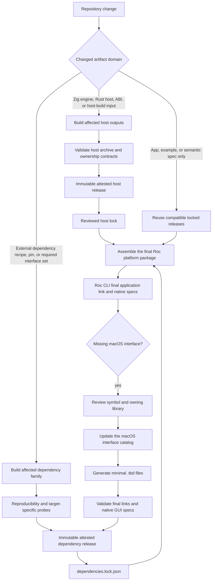
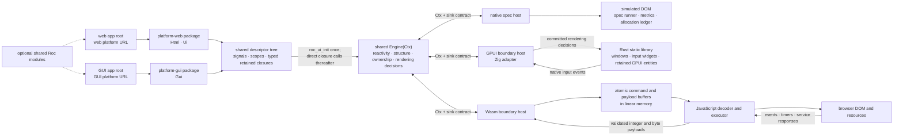
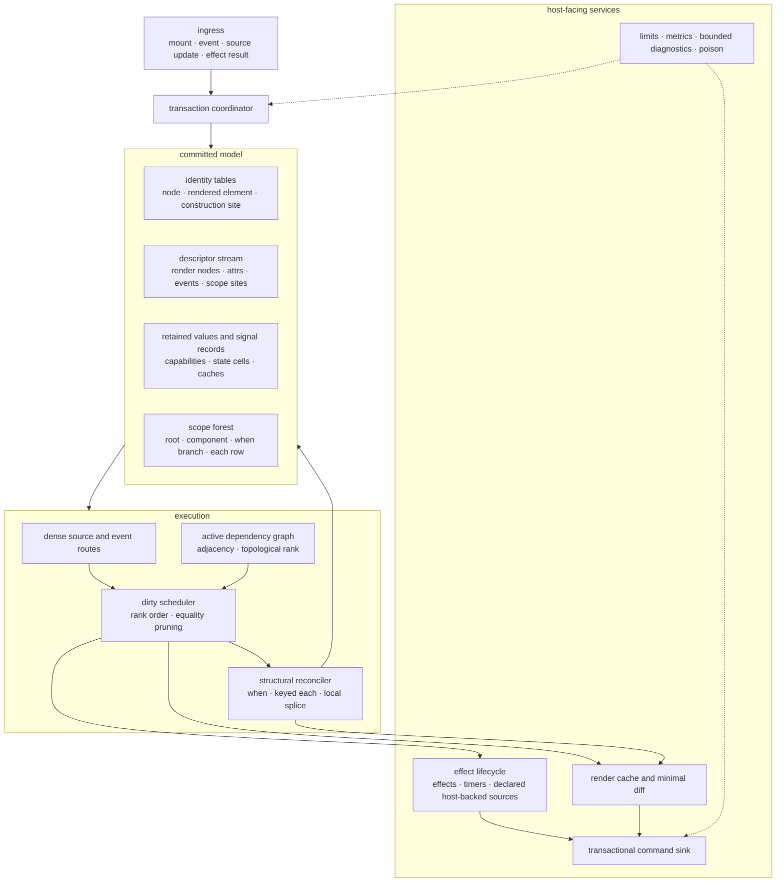
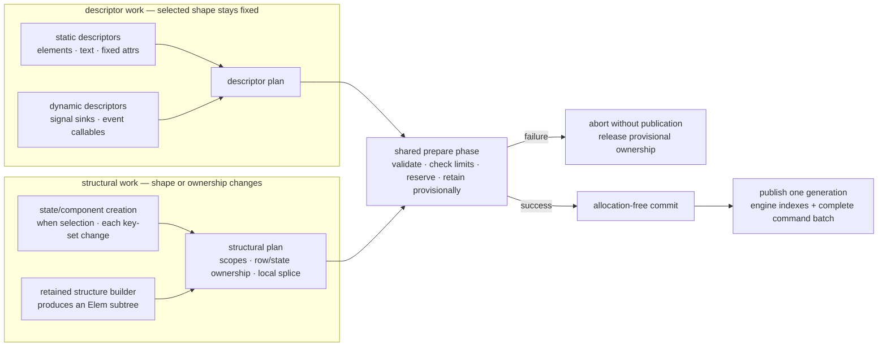

# Signals UI Platform — Target Design

This document is the single authoritative design for the Signals UI platform. It
describes the architecture we are building toward and the invariants every part
of it must hold. It is forward-looking and enduring: it describes the system as
it is meant to be, not the current state of a work queue. Live work tracking
belongs in issues and pull requests.

## How to read and evolve this design

The main body defines semantic laws, ownership boundaries, complexity
obligations, and the reasons for them. The appendices retain detailed target
contracts without making every representation choice a permanent principle:

- [Appendix A](#appendix-a-target-api-surface) records the target API surface.
  Public module documentation and the [reference](www/content/docs/reference.md)
  describe the shipped surface; a target signature is not a claim of availability.
- [Appendix B](#appendix-b-browser-protocol-contract) records the browser ABI
  and encoding. These are normative for a protocol version, but may evolve
  through explicit producer/consumer changes and compatibility validation.
- The [native protocol manifest](protocol/native-protocol.json) owns native
  presentation, effect, and timer versions and layout tables. The
  [native boundary contract](docs/native-gui-protocol.md) supplies their detailed
  encoding and executor rules; the architectural laws below govern every host.
- [Appendix C](#appendix-c-representative-apps) describes the representative
  workloads used to test the architecture. Their membership is replaceable;
  coverage of the capabilities is the enduring requirement.

Internal representations may change when their replacement preserves these
contracts and improves measured cost or clarity. Capability-owned erasure and
scope-owned lifetime are architectural laws; a tree branching factor, a packed
slot layout, or an inline adjacency representation is an engineering choice.
Neither an optimization nor a compiler workaround may change application meaning.

Current setup and gates belong in [contributing](www/content/docs/contributing.md);
measurement procedures belong in [profiling](docs/profiling.md); numeric targets,
baselines, implementation gaps, and delivery plans belong in issues. Those
documents provide evidence and workflow, not exceptions to the semantic laws.

## Thesis

Roc Signals exists so that a Roc developer can build an interactive browser or
native UI in pure Roc and trust it the way they trust the rest of their Roc code: values
in, values out, no hidden mutable runtime in the app, and its reactive semantics
checkable independently of a browser. Purity here is precise: UI description
and state transitions are pure, and the only effectful Roc is an action's
declared effect, which the engine schedules after that action's state changes
commit and which reaches the outside world solely through the platform's
hosted functions. The app describes its UI as data — a
descriptor tree whose dependency edges are already explicit in the structure
of each `map`/`map2`/record-builder call — and hands that description to a
host-owned engine once. From then on, the engine re-runs only the closures
whose inputs changed, in dependency order, and emits only the rendering decisions
those changes imply. There is no virtual DOM and no per-event re-render; work
is proportional to what changed, and that claim is enforced by counters a spec
can assert, not by benchmarks a reviewer has to trust. Browser and GPUI executors
apply those decisions through their own presentation systems.

The one-sentence wedge: **pure Roc, no VDOM, updates local to affected
dependencies, and fast native specs backed by browser and desktop interaction
evidence.**

It is for Roc developers building interactive browser applications — dashboards,
forms, routed multi-page apps such as Conduit — and native tools such as document
editors, task boards, folder explorers, and log viewers. It is not a general
replacement for the JavaScript ecosystem, not a UI toolkit for other languages,
and not a server-rendering platform.

## Product Goals (author-facing)

These are the requirements, and they are principles rather than tasks: each is
a property the platform must hold for its whole life, from which every
mechanism, spec, and maintained app derives. Gaps between this document and
the implementation are tracked in issues, never here. The *Success Criteria* below say how each
principle is observed; this section says what it is.

1. **The idiomatic way is the correct way.** The simplest thing an author can
   write must be the thing the platform is designed for. If the natural
   expression of a UI shape needs an encoding trick, a positional convention, or
   hand-written boilerplate the compiler could derive, the platform is wrong,
   not the author. Workarounds are defects of the platform's API.

2. **Composition is first-class.** UI is built from typed, reusable units that
   take inputs and children, own their local state and effects, and can be
   published and imported as ordinary Roc packages. An application decomposes
   by feature into modules; nothing in the platform forces structure into one
   place.

3. **The scaling promise holds for apps, not just the engine.** Work
   proportional to the changed set is a property authors get by writing
   idiomatic code, not one they must engineer around the engine. Where a
   natural idiom would defeat it, the platform provides the primitive or the
   documented pattern that restores it, and the property is pinned by
   observable work counters.

4. **Failure is legible.** Every contract violation — in a descriptor, a key, a
   capability, a payload, a budget — is reported to the author as a readable
   diagnostic naming the construction site and the rule broken, identically
   under the native runner, in the browser, and at the GUI boundary. A bare trap,
   an integer code, or a silent no-op is never an acceptable way to fail.

5. **There is exactly one door to the outside.** Events, effects, environment
   sources, and third-party integration travel through declared, scope-owned,
   typed boundaries and the same engine scheduling and ownership model.
   JavaScript uses the browser boundary vocabulary; native services are hosted
   effectful functions with validated primitive payloads, callable only from
   engine-scheduled effects. Neither surface exposes
   an application back door into host state or requires runtime edits per app.

6. **Cost is visible and bounded.** Payload size, startup, and per-event work
   are measured, budgeted, and enforced continuously, so an author can reason
   about what an app costs before shipping it and a regression cannot land
   silently.

7. **Testable at the right boundary.** Reactive semantics, ordering, work,
   and cleanup can be asserted in fast, deterministic native tests in
   user-facing terms. Browser tests establish actual input, focus, layout,
   accessibility, and integration behavior. GPUI adapter tests and native desktop
   journeys establish the corresponding native input, focus, layout, and service
   behavior. Tests are evidence within their model; a simulated DOM is not a
   proof of browser or operating-system interaction.

8. **Approachable and honest.** A developer who knows Roc can learn the model
   from the documentation alone, and what the documentation says is what the
   platform does. Real applications are not more verbose than their
   equivalents on mature frameworks.

9. **Interaction and accessibility are part of correctness.** Ordinary controls
   support keyboard use and meaningful accessible names and relationships.
   Structural changes have explicit focus, selection, and composition behavior.
   A rendering optimization must preserve those contracts as well as graph
   identity and visible text.

10. **Intent and coordinated state are expressible directly.** Repeated actions
    remain distinct even when their payloads are equal. Authors can partition
    independently changing state and still express one atomic domain transition,
    without serial-number encodings or effect chains used to repair intermediate
    state.

## Success Criteria

Success is judged in three tiers. Tier 1 is necessary and is where most of the
engine investment lands, but **Tier 1 alone cannot declare success**: an engine
that satisfies every invariant while no one can write an app against it has
failed. Tiers 2 and 3 are the externally visible outcomes the engine exists
to deliver.

**Tier 1 — Engine invariants.** The properties listed under *Measures of
Effectiveness* below (one engine, thin hosts; each platform's apps in semantic
specs and its live executor; native semantic evidence; work scales with change;
deterministic reclamation with no leaks; determinism; incompatible erased-value
routing is rejected), with production checks and bounded transaction failure.
*Evidence:* native specs with `expect_metric_delta`, host tests, fault
placement, mutation-tested fuzz targets, and release-build boundary rejection tests.

**Tier 2 — Author outcomes.** Each product goal has a standing measurement:

- *Idiomatic is correct:* the count of workaround sites in the maintained
  suite (encodings through keys, positional readbacks, derivable boilerplate)
  is zero.
- *Composition:* a maintained app factors a repeated fragment into a typed,
  packaged unit; a fixture proves inputs, children, and scoped state.
- *Scaling for apps:* a one-row change in the large keyed fixtures runs O(1)
  Roc closures, pinned by `expect_metric_delta` on `derived_calls_into_roc`.
- *Legible failure:* one fixture per contract-error class asserts the
  diagnostic text and site attribution on each applicable host.
- *One door:* an interop canary integrates a third-party widget through the
  declared boundary only.
- *Bounded cost:* compressed artifact size, construction cost, interaction
  latency, steady-state memory, and transaction peaks have recorded budgets.
  Deterministic work and size limits gate CI; repeatable production-browser
  measurements support release acceptance under an explicit noise policy.
- *Testable at the right boundary:* maintained app semantics run natively;
  browser and GPUI contract tests plus live interaction journeys establish
  integration on their respective surfaces.
- *Approachable:* newcomer exercises record time, errors, and framework-specific
  ceremony for deployment, component extraction, validation, preserving an edit
  across navigation, and diagnosing unexpected work. Line count is supporting
  evidence, not the definition of ergonomics.
- *Interaction and accessibility:* browser journeys cover keyboard navigation,
  focus restoration, input composition and selection, accessible relationships,
  and focused row movement. Desktop journeys cover native editing, modal focus,
  shortcuts, and scoped control lifetime. Native specs cover shared rendering
  semantics; semantic labels alone establish no screen-reader integration.
- *Intent and coordination:* fixtures prove identical repeated submissions,
  atomic multi-source resets, and effect observers that see settled state only.

**Tier 3 — External evidence.** Evidence that is legible to people who have not
read this document:

- A keyed `js-framework-benchmark` submission reporting every required operation,
  startup, size, and memory against declared comparison implementations.
  Numeric acceptance targets and baselines live with the benchmark evidence.
- Conduit passing a real-browser end-to-end run (Playwright) against the
  RealWorld specification, not only the native spec suite and the DOM double.
- Compressed Wasm and runtime size budgets enforced as upper bounds.
- Native applications built against the independently prebuilt GUI platform,
  with semantic specs and live desktop evidence for editing, file workflows,
  rendering, and shutdown on each supported native target. Supported systems
  and release evidence belong in the maintained native documentation.

## Non-Goals

Stating what is out of scope is part of the design. Each item below is a scope
decision with the condition under which it would be reconsidered; none is an
omission.

- **Server-side rendering, hydration, prerendering, and SEO.** The platform is
  a client-side runtime. Reconsidered only once Tier 3 evidence exists for the
  client story. Any server path must keep the command stream as the only
  render output and must not introduce a second reactive mechanism: hydration
  would be the engine adopting existing DOM ids, never JS reconstructing
  meaning.
- **Multiple roots per Wasm instance.** One mount owns one instance; roots are
  isolated by instance, not by handle. Reconsidered only if many-widget
  embedding measurements show per-instance memory or startup cost is
  unacceptable (see *Open Questions*).
- **Out-of-memory recoverability beyond trap-and-remount.** The engine keeps
  preparation fallible and publication allocation-free so a failed transaction
  never exposes a partial generation, and *Memory management and allocation
  failure* is authoritative for that containment. Resuming a poisoned instance
  or making every callback boundary recoverable is not a goal: the browser's
  own answer to exhaustion is to reload, and the platform's answer is a fresh
  instance. Reconsidered only if the Roc callback ABI gains explicit failure
  and ownership-unwind semantics.
- **A general-purpose JavaScript FFI.** Apps do not call arbitrary JavaScript.
  Integration goes through the single declared door (see *One door to
  JavaScript*). Reconsidered never; a use the door cannot express is a reason
  to extend the door's typed vocabulary, not to bypass it.

### Traceability

Every later section of this document, every spec, and every maintained app
must be able to say which product goal or Tier 1 invariant it serves. A
proposed design change that serves no goal is out of scope, however elegant;
a goal with no section, spec, or app serving it is a gap to close, not a
sentence to delete.

## Purpose and Host Architecture

The thesis and product goals above are the requirements; the engine described
from here on is the means. The product is built on a **host-agnostic reactive engine**: a mutable node table,
topological-rank scheduler, dirty set, `is_eq` value pruning, scope forest,
keyed-row diff, identity tables, and structural splice/collect/apply. The engine
owns all reactive and structural logic. It is the single source of truth for how
a Signals app behaves.

The engine is driven by **thin hosts** that implement one contract — a
`Ctx` (host capabilities the engine calls) plus a `sink()` (where the engine
writes render commands). The hosts differ only in their boundary, never in their
reactive behaviour:

- **Native host** — the spec/telemetry/debug host. It backs the engine with a
  simulated DOM (a flat `DomElement` array), a semantic-locator spec runner, an
  allocation ledger, and fine-grained work counters. It compiles to a native
  binary, so ordinary tooling (`lldb`, allocation tracing) can inspect crashes
  and memory behaviour directly. Its job is **low-level observability and
  semantic assertion** — the things a live presentation system cannot show us.

- **Wasm host** — the browser-boundary host. It backs the engine with a
  command-buffer sink serialized into linear memory, plus the JS↔WASM boundary:
  UTF-8 marshalling, event-payload codec, `memory.grow` view coordination, and
  timer/`fetch` bridges. Its job is **the JS↔WASM contract only**. It contains
  no reactive or structural logic; that all lives in the engine.

- **GPUI host** — the native GUI boundary. A Rust static library owns windows,
  input widgets, and retained GPUI entities. Events enter the same Zig engine;
  GPUI consumes its committed rendering decisions. GPUI notifications invalidate
  rendering, not a second signal graph. Roc values remain opaque to Rust.
  Native fixed-height viewport presentation queries an indexed projection of engine-decided child order.
  It bounds native layout to the visible range without changing reactive row
  scope lifetime. Sparse child updates remain proportional to changed index
  paths; ordinary full snapshot replacement retains its explicit broad cost.
  Follow-tail is a declared native presentation policy, not a signal producer.

`platform-web` exposes the browser vocabulary; `platform-gui` exposes a native
`Gui` vocabulary over the shared signal and scope model. Platform packages can
have different public rendering APIs without duplicating reactive semantics.
The GUI host is prebuilt independently of application code; `roc build` links
it, the shared engine, and the application into a native executable. Each
platform must declare its supported effects explicitly rather than silently
substitute browser services on native systems. The GUI boundary has the same
ownership, atomic publication, disposal, and O(changed) obligations as the web
boundary; these are requirements, not claims that every implementation path
already satisfies them.

### Native build and final-link artifact boundaries

Signals-owned host outputs and operating-system linker inputs have independent
identities and release cycles. The web package's native `libhost.a` archives and
`host.wasm`, plus the GUI package's `libengine.a`, Rust GPUI host archive, and
Windows application resource, are app-independent host outputs. A change to the
Zig engine, the relevant host, their ABI, or an actual host-build input
invalidates the affected outputs; an application, example, semantic spec,
documentation, platform API, or final-link input change does not. Compatible
host outputs are reused through immutable attested host releases selected by
reviewed host locks.

External linker inputs are never folded into that host identity merely because
Roc CLI will place them on the same final link line. glibc startup and link
stubs, FreeType, xkbcommon, LLVM unwind, Windows imports/runtime archives, and
the project-authored macOS `.tbd` files are immutable attested dependency
releases selected by `dependencies.lock.json`. Each dependency family rebuilds
only when its reviewed recipe, source/toolchain pin, or required interface set
changes. The final platform package combines independently verified host and
dependency artifacts; neither release is permission to relabel or rebuild the
other.

macOS interface discovery is downstream of the completed host and dependency
artifacts. Roc CLI's final application link is the authoritative compatibility
check. If it requires an interface absent from the selected `.tbd` release, the
failure starts a separate review: establish the exact symbol and owning
framework or library, update the reviewed interface catalog, generate the
minimal `.tbd` files, validate final links and native GUI specs, then publish
and attest a new dependency release. Ordinary CI and platform bundling consume
those exact locked bytes; they do not regenerate interfaces. The `.tbd` files
are not inputs to compiling either host archive.



The project publishes two distinct Roc platform packages. A web app root names
the `platform-web` package and can compile against that package's native spec
host or its Wasm/browser host. A GUI app root separately names the
`platform-gui` package and compiles against its native GUI vocabulary and hosts.
The roots do not compile interchangeably: their platform APIs and package URLs
are different. An application may place ordinary Roc modules shared by both
roots above that boundary, while keeping each root's platform-specific wiring
explicit.

Within the web package, the native spec host simulates the browser-facing
semantics and asserts work budgets; the Wasm host and JavaScript runtime run the
web app in a real browser. The JS runtime is a thin executor of the engine's
already-computed command stream — it never reconstructs meaning, holds reactive
state, or re-decides patches. The GUI package has its own semantic and live
native execution paths over the same engine, without acquiring the web API.



## Non-Negotiable Constraints

These constraints come from the platform's role and from the discipline this
document is meant to preserve. Every part of this design must respect them.

1. **No compiler changes.** We may not require dataflow
   analysis passes, dependency-graph extraction, or compiler behavior introduced
   specifically for Signals. Everything is ordinary Roc plus a Zig host.
   Upstream fixes to Roc's existing language and ownership contracts are distinct
   from new platform semantics; compiler requirements belong in contributor
   documentation and reproducible defects belong in upstream GitHub issues.
2. **No guessing or recovery that changes meaning.** The host never guesses
   what changed, scans to rediscover identity, or reconstructs missing
   information. It consumes explicit Roc declarations. An explicit alternative
   such as exact snapshot reconciliation for a nonmatching parent generation is
   valid because it preserves the contract and exposes its cost. Optimizations
   and recovery paths must meet the same standard.
3. **Work scales with the number of changed nodes, not with tree size.** This is
   the entire point of signals. Per event, the host re-invokes only the Roc
   transform closures whose inputs actually changed, in dependency order. There
   is no full-tree re-walk and no full re-render per event. **This constraint
   binds the data structures, not just the algorithm.** A path that is "linear in
   the changed set" on paper but reaches that set through a linear scan of all
   nodes, a linear pointer→id lookup, or a full graph rebuild is a violation, not
   an implementation detail. Identity→id resolution, descriptor lookup, and
   dependency-graph maintenance must be O(1) or O(changed), never O(total). See
   *Complexity Discipline* below for the precise budget every code path owes.
4. **Mutation lives only in the host.** Application Roc is pure and
   value-oriented outside an action's declared effect, and an effect touches
   the outside only through hosted functions the host implements. The
   reactive runtime — the dirty set, the scheduler, the in-place node table — is
   intrinsically mutable, so it lives in the Zig engine/host, which is the one
   place mutation is legal.
5. **Type-mismatch crashes are structurally impossible.** A typed `Signal(a)`
   stays typed end to end. Erasure is confined to one generated set of ownership
   operations per edge — a **capability** bundling clone, equality, and drop,
   with typed split private to those operations and edge-specific extension
   records carrying their owning capability — pinned to that edge's
   monomorphized types. There is no host-authored read site that can disagree
   with the writer, and no host-side knowledge of the value's layout. See
   *Confined Erasure*.
6. **One engine, thin hosts.** All reactive and structural logic lives in the
   shared engine. A host file contains only its boundary (sink, marshalling,
   spec runner / JS bridge / GPUI adapter) and its `Ctx` implementation. Reactive
   or structural logic appearing in a host file is a defect: it lets the hosts diverge,
   which this architecture exists to prevent.

## First Principles, Not Imitation

We are not porting Solid, Elm, or Incremental to Roc. We are deriving the model
that *fits Roc* — a pure, value-oriented language with no mutable globals, no
ability auto-derivation, and a hard "no compiler changes" rule. Those three
frameworks are useful reference points for what works and what does not, but the
design below follows from Roc's constraints, not from any of them.

The reference points:

**Elm** rebuilds the view and diffs per event. That is O(view size) per event
and is the opposite of signals. We reject the *mechanism* (per-event re-render),
not the discipline — Elm's "pure description of UI, effects as data" is exactly
the shape we keep.

**Solid** discovers dependencies by *running* effects and watching reads through
a mutable global "current observer." Its great strength is precise, lazy edges:
a node that conditionally reads `B` only depends on `B` while it actually reads
it. Roc cannot observe its own reads and has no mutable globals, and we cannot
add compiler support to fake it. So we cannot copy Solid's *mechanism*.

**Jane Street's Incremental / Adapton** are the honest lineage of what we *can*
build: an explicitly-constructed dependency graph, a topological-rank scheduler,
and a value cutoff (`is_eq`) that stops propagation when a recomputed value is
unchanged. This is push-based incremental computation over a graph the program
declares rather than one the runtime discovers.

**The reframing that makes signals work in pure Roc:** in Solid, dependencies
are *discovered* at runtime. In a pure language, dependencies are *declared* —
they are already present in the structure of each `map`/`map2`/`combine` call,
or in Roc record-builder syntax such as `{ price: price, qty: qty }.Signal`,
before anything runs. When the app writes a two-input derived signal, the edges
`price -> result` and `qty -> result` are *data*. So the host never needs a
current-observer stack and never runs a closure to find out what it reads. The
**dependency graph is handed to the host as a value, once.** The host then owns
a mutable node table and runs push-based incremental propagation over it.

This is "the graph is Roc data, the runtime engine is the host." It keeps
signals' linear-with-changes scaling, fits Roc's purity, and needs zero compiler
changes.

**The tradeoff we accept, stated plainly.** Declared edges are *eager*, not
lazy. A node that depends on `{cond, A, B}` to express `if cond then A else B`
stays subscribed to all three; when `cond = true` and only `B` changes, the host
still wakes the node and runs its transform, and `is_eq` pruning only suppresses
the *output* after the work is done. Solid would not wake the node at all. We
accept this because the alternative — lazy, read-tracked edges — requires
observing Roc's reads, which the no-compiler-changes rule forbids. The escape
valve for genuinely dynamic dependency *structure* (a derivation over a
value-dependent set of inputs) is the same scope mechanism that powers `Ui.each`
(see Identity and Dynamic Structure): a sub-graph that is rebuilt when its shape
changes, not a static edge that is always live. Dynamic-cardinality reactivity
and dynamic list structure must therefore share one mechanism, never two.
The same eagerness has an app-level consequence: a single coarse `Model` state
with many `map` projections wakes every projection on every change, so the
idiomatic state shape can defeat the scaling claim even when the engine honours
it. Product Goal 3 (the scaling promise holds for apps) owns the answer, and
the design supplies both halves: `Signal.select` for keyed membership, and the
partitioning rule that independent concerns are independent signals (row-local
`Ui.state`, one signal per field that changes on its own) rather than
projections of one coarse record. Component boundaries preserve that granularity:
a named record of signals is the default for independently changing inputs.
A `Signal(Props)` is appropriate when the props form one coherent value; it does
not provide independent field invalidation merely because projections occur
inside a component.

## Values, Actions, and Coordinated State

A signal describes a current value. An action describes an occurrence. Equality
prunes value propagation; it does not erase two separately accepted clicks,
submissions, retries, or refresh requests with equal payloads. The platform owns
occurrence identity and request lifecycle. Application authors must not need a
counter, nonce, or request-string suffix solely to make a repeated action happen.

Action handlers are pure descriptions of state transitions and effect requests.
Their declared reads and writes use typed capabilities and the same engine
scheduler, scopes, limits, and metrics as every other input. There is no mutable
Roc event runtime, implicit dependency discovery, or separate propagation path.
Concrete helper names belong to the API contract; this distinction holds
regardless of their spelling.

An action is data the engine interprets: an atomic batch of state changes,
optionally followed by one effectful continuation. Every state change is a
reducer applied at its own commit against the value the state holds then; an
explicit replacement is a reducer that ignores that value. The continuation
runs only after its batch commits and receives a fresh post-commit snapshot
of its declared reads — or, when that commit retired the read states, the
snapshot its handler observed — and returns the next action, which the
engine applies the same way. Reducers therefore run against current state;
this does not make a captured response current or prevent an application from
explicitly replacing state with it. Rejecting an obsolete response remains
application race policy. Effectful code can neither observe nor mutate
mid-turn state. Both platforms use this contract.
Their executors consume the same prepared thunks; execution substrate and
deployment constraints do not change the action laws.

An action may coordinate several independently owned sources. All declared
reads observe the same settled pre-action snapshot. Its write set contains at
most one proposed replacement per source; duplicate destinations are contract
errors rather than an implicit last-writer convention. The engine prepares the
complete write set, validates ownership and capacity, then propagates from all
changed sources together. Derived values and value-change effects observe the
settled result, never a prefix of the writes. A handler can compute related next
values locally without exposing intermediate assignments.

Sources may be coordinated only while their owning scopes are live. Updating a
source does not transfer ownership or extend its lifetime. State that must
outlive a rendered region is owned by an explicit longer-lived scope. Ordinary
component functions accept static values, named records of signals, and typed
action callbacks without requiring descriptor inspection.

Because state changes are reducers at their own commit, a timer tick or an
effect's result can append to retained history without subscribing its
producer to the history: the reducer reads the settled value when its command
executes and proposes the replacement through the ordinary transaction. A
change description is reusable, and preparation refusal may evaluate it
again; it never captures or borrows an earlier state value.

### Equality is an observation contract

A successful `is_eq(a, b)` permits the engine to retain the cached value and
skip every downstream observation on that edge. It must therefore imply that
those observations cannot distinguish `a` from `b`. Ignoring a field that a
downstream transform, renderer, or effect reads violates this contract.

A conservative comparison may return false for observationally interchangeable
values; that permits extra propagation rather than suppressing a meaningful
change. Value-change effects follow this declared comparison and may therefore
run again; action occurrence semantics do not depend on it.
Comparisons must be pure and deterministic, and their execution and allocation
cost count toward the operation budget. The platform must not assume laws such
as reflexivity when a supported value's comparison does not provide them.

`Rows.is_eq` is a generation comparison, not content equality: aliases of one
immutable generation compare equal, while independently constructed generations
may compare unequal even with equal items. `Rows.content_is_eq` supplies the
explicit content operation. Generation identity is not application identity and
must not be serialized as a key or used to encode action occurrences.

## Core Concepts

- **Signal(a)** — a continuous, always-present value of type `a`. Opaque typed
  descriptor that references a source binder or derived expression. The `a`
  exists only in Roc's type system; the host assigns the runtime node id when it
  ingests the descriptor tree.
- **Source** — a node whose value is set by host input (a browser or native event,
  a timer, an effect result). Local state sources are introduced by the `Ui.state` closure
  binder; effect combinators introduce effect sources.
- **Derived node** — `map`, `map2`, `combine`. Holds a retained Roc transform
  closure plus its input node ids. The host recomputes it when an input changes.
- **Reducer** — a pure state transition closure attached to a source through a
  `Node.Handler`. Unit reducers are `a -> a`; payload reducers are typed wrappers
  such as `(a, Str -> a)`, `(a, Bool -> a)`, or `(a, KeyPayload -> a)`. The host
  retains the erased reducer and calls it when the bound event fires.
- **Scope** — a host-owned region that owns minted node ids and retained
  closures: the root, each conditional branch, and each list row are scopes.
  Disposing a scope drops its refcounts and detaches its rendered structure.
- **Elem** — a pure description of UI structure that references signals for
  dynamic text/attrs and references reducers for event handlers. Element nodes
  carry a tag string, attrs, and children; user-controlled copy stays in text
  nodes (`Html.text` / `Html.text_s`), not raw HTML.
- **Selector** — a host-owned keyed node derived from a `Signal(Str)`. Each
  member `Signal.select(keys, k)` is a `Signal(Bool)` that is true while the
  selected string equals `k`. When the key changes the host dirties exactly the two
  members whose membership changed; no member closure runs for the rest. This
  is how "which row is selected" stays O(1) per change at any list size.
- **Component** — a typed, reusable unit of UI with inputs, children, and its
  own scope for local state, effects, and cleanup. A component is an ordinary
  Roc function that returns `Elem`; `Ui.component` gives it the scope.
  Components are published from ordinary Roc packages.
- **Action** — the unit of event handling: an atomic batch of state-change
  reducers, optionally followed by one effectful continuation the engine runs
  after the batch commits with a settled snapshot of the action's declared
  reads. Shared by both platforms; see *Values,
  Actions, and Coordinated State*.
- **Cmd** — the typed unit an action, lifecycle hook, or signal-change sink
  hands the engine. On every platform it carries atomic state-change batches
  and an action's effectful continuation; on the browser it also carries outbound service
  requests — navigate history, set the title, write or remove storage, send
  a message to an attached widget — whose results
  re-enter the graph through the same propagation queue as a click.
- **Sub(a)** — a typed, inbound, long-lived source declared by structure and
  owned by the scope that declares it: browser timers, browser environment values
  (location, visibility, online, storage), and widget events. Subscriptions
  are diffed by stable descriptor identity, started when their scope is
  created, and stopped when it is disposed. Inbound payloads use the shared
  boundary schema vocabulary, and any retained source value or callback uses
  the same capability-owned `HostValue` model as events and effect snapshots.
- **Effect registry** — the typed table, built at ingestion from the
  descriptor tree, that maps each declared `Cmd` kind and `Sub` kind to its
  host route and to the capability that decodes its result. Routing is by
  dense registry id, never by a string convention. The registry is the
  routing contract for subscriptions and widgets; hosted effectful functions
  route directly and are not entries in a task registry.

## Identity: Construction-Site Within Explicit Scopes

There are no author-written node ids or event ids. Three identities serve
different purposes and must not be conflated:

- **Signal alias identity** says that two descriptors refer to the same
  computation or source. Cloning a descriptor preserves this identity.
- **Structural identity** is the construction site within a live owning scope.
  It governs the lifetime of state, branches, components, and row instances.
- **Application identity** is an exact stable key within one collection site.
  It preserves a surviving row's scope across collection changes, not across
  disposal or across independent sites.

The host resolves these explicit identities during ingestion. A callable
address is an internal alias token, never an application key, source-code
location, or promise of identity across mounts.

Signal alias identity is the address of the boxed callable the signal already
needs for evaluation: initializers identify constants, state, and
intervals; transforms identify derived signals; browser sources use their
`from_payload` transforms. The descriptor carries this pointer as both the
record's identity and its evaluator, and ingestion asserts that they agree. Cloned signal descriptors therefore share a record, while two
separately constructed signals get distinct callable allocations even when they
use the same specialization. A fused keyed-row selector instead has composite
identity `(site callable, row handle)`: one site owns the typed reader,
selected/unselected initializers, and output capability, while every row remains
an ordinary independently cached graph record registered under its exact key.
Persistent and transaction-local composite indexes are separate from the
callable-only indexes used by other signals and effects. Callable addresses are lookup keys only; the host
still owns separate dense node, active-graph, effect-occurrence, interval, and DOM ids.

- Within a scope, structural sites are numbered in deterministic descriptor
  traversal order. A construction site is a declaration in that scope, not a
  source-line number or the chronological order of arbitrary Roc evaluation.
  Reusing a live site preserves its identity; disposing its scope ends that
  identity. A later mount at the same ordinal is a new lifetime.
- **Scopes contain positional shifting.** Because components, conditional
  branches, switch cases, and list rows are first-class scopes, adding or
  removing UI inside one scope does not shift identities in sibling scopes. This is the new failure mode we design
  around: "where you built it is your identity," so the seams that can shift
  (branches, lists) are explicit scope boundaries.
- **Dynamic lists use stable UTF-8 key material, not position.** `Ui.each` takes
  a `Signal(Rows(item))`; the immutable `Rows` value owns the one
  `item -> Str` key function used for every generation. Identity is the exact
  UTF-8 byte sequence returned when an item enters or changes: no normalization,
  case folding, locale transform, lossy decode, or hash-only equality is
  permitted. `Rows` caches that key beside the item and maintains an exact-key
  index; the host owns copied key bytes for each live row and hashes them
  privately for its site lookup table. Collisions and duplicate-key checks
  compare complete bytes. Within one live site, a surviving row's identity is that key, so its local
  state survives reorder and insertion or deletion of other rows. Duplicate byte-identical keys are an ordinary
  `Rows.Error` while constructing or editing a value and a contract error if an
  adapter violates the authenticated transition ABI; they are never aliases.
  Row handles, sink tokens, generations, and all host-minted dense identities
  are nonzero and nonwrapping: an exhausted generation retires its slot instead
  of aliasing an earlier lifetime, and an exhausted dense id space is a resource
  error rather than permission to reuse a live or stale identity.

- **Branches are built when selected, not at construction.** `Ui.when` and
  `Ui.switch` retain their branch builders as structure closures; the host
  invokes the builder for a branch when that branch becomes live and disposes
  the branch scope when it stops being live. Because an unselected branch is
  never built, a structure may refer to itself through a branch and terminate:
  recursive UI (a tree of query groups, nested markdown blocks) is expressed
  directly, never encoded into a list key.
- **A component is a scope.** `Ui.component` mints a scope for the component
  body, so the body's `Ui.state`, subscriptions, and cleanup are owned by the
  component and construction order inside it is independent of the caller.
  Two uses of the same component at different sites are different scopes with
  different identities; identity still comes from the construction site, not
  from the component's name.

### Observable lifetime rules

| Change | State and effects | Rendered structure |
|---|---|---|
| Reorder a surviving key within one site | Preserve its scope, state, and active work | Move existing nodes; preserve editing interaction |
| Insert or remove another key | Preserve unaffected row scopes | Splice only affected rows |
| Update an item without changing its key | Preserve its row scope; propagate the item value | Update affected sinks and nested structure |
| Remove a key, including filtering it out | Dispose that row's state and stop its subscriptions and timers; an admitted effect it started survives and reparents (*Requests, effects, and cancellation*) | Detach its subtree |
| Reinsert a previously committed removal | Create a new row lifetime, even with the same key | Build new structure |
| Remove and reinsert within one unpublished Rows edit batch | Preserve the slot and row scope if the final generation retains the key | Reconcile only the final generation |
| Change an item's key | End the old row lifetime and create a new one | Remove and insert |
| Move an item between independent list sites | Dispose at the old site; create at the new site | No implicit cross-site scope transfer |
| Switch branch or route case | Dispose the departing branch; retained ancestor state survives | Mount the selected branch |
| Hide a live region with an attribute or class | Its scope and effects remain live | Keep nodes subject to the declared visibility policy |
| Dispose a component or root | Dispose every resource it owns | Detach its rendered structure |

Filtering preserves the state of rows that remain live, not of rows removed and
later restored. State that must survive filtering, pagination, virtualization,
or route changes belongs in an explicit longer-lived owner keyed by domain
identity. Keeping a scope alive must never be inferred from a reused key.

Visibility, suspension, and disposal are different contracts. A future explicit
suspension facility must define effect activity, focus, retained-memory bounds,
and resumption before it can promise preserved state. There is no implicit
`keep_alive` exception to disposal.

## Confined Erasure: No NodeValue, No Decode Crash

The host's node table is heterogeneous, so values cross the boundary as opaque
payloads. Erasure is confined to **one capability per retained edge**, pinned to
that edge's monomorphized types:

- For each `map`/`map2`/`combine`/`state`/source/sink edge, platform Roc builds a
  concrete capability at the call site. Static dispatch resolves the value's
  required operations (`is_eq`, key hashing, sink reads, and similar
  edge-specific functions), and monomorphization specializes the capability and
  any capability-owned extension record for that edge's concrete `a`.
- The host **never chooses** a decoder, destructor, comparator, or reader. It
  stores a boxed, opaque Roc value and invokes the capability that owns that edge.
  There is no second, independently typed read site, so a mismatch is a routing
  checked contract failure before typed access in every build.

Hot-path values are stored as **boxed typed Roc values the host never
inspects**. Equality uses the capability's typed `eq`; byte serialization is
reserved for persistence and the wire, never forced on every event. We do not
`memcmp` encoded bytes for equality (fragile for floats/maps), and the host never
reconstructs type semantics from bytes.

This opaque carrier must be produced at a real typed edge boundary. It is not a
generic `Box({})` field in the descriptor tree: Roc keeps `Box(a)` typed, so a
generic `Opaque(a)` value cannot be placed directly into heterogeneous `Elem`
payloads. The platform boundary produces a `HostValue` cell at the monomorphized
call site and carries the capability that owns that cell.

There is no untyped value representation crossing the boundary. The public API
is a few polymorphic functions (below); monomorphization generates concrete code
for each instantiation, so there is no hand-written family of type-specialized
combinators.

### Where the invariant actually lives, and how we check it

Confined erasure moves the type-mismatch hazard, it does not delete it. Roc's
type system guarantees that *each* thunk is internally type-correct. It does
**not** guarantee that the host hands a given opaque payload to the *right*
thunk: that correctness is a property of the host's wiring matching the
descriptor that produced the thunks. A wiring bug — delivering the box from edge
X to the thunk that owns edge Y — is therefore not a clean Roc error but
undefined behavior in the thunk.

Two rules keep this invariant honest:

1. **The routing is consumed, never reconstructed.** The host builds its
   `event_id -> source`, edge, and sink tables from explicit callable identities in the
   descriptor. It never re-derives which thunk owns which value by guessing from
   structure or bytes.
2. **Capability ownership assertions.** Every opaque `HostValue` cell carries
   the app-compiled capability that owns it. Public get/take operations must
   present the same capability, and internal split/take operations are accepted
   only while the host is executing an app-compiled callable under an active
   frame containing that owning capability. If a value crosses to the wrong edge,
   the host reports a capability mismatch instead of trying to recover. This is
   part of the design, not an optional extra. Capability, active-frame, and
   handle-lifetime validation remain enabled in production. Debug builds may
   add redundant audits, but removing them must not remove the validation that
   prevents an opaque value from reaching an incompatible typed callable.

### The capability: bundled ownership operations per retained value

A thunk that *reads* an erased value is not enough. The host does not only read
these values — it **owns their lifecycle**. After `roc_ui_init` the host owns the
mutable runtime graph: state cells, source caches, derived-signal caches, keyed
collection generations, effect snapshots, and sink values. Those cells are
replaced during propagation, pruned when unchanged, cloned for non-consuming
reads, and destroyed when a scope is disposed or the app unmounts. At each of
those moments the host is the only code that knows a particular value is now
dead, so the host is the code that must release it.

The prebuilt host cannot release an app value by inspecting it. The host can own
an opaque cell, but `a` comes from the app, not the platform. When a retained
`Box(a)` reaches its final release, the payload's nested refcounted fields — a
`Str` backing, a `List`, a record of lists, a tag union carrying a heap string —
must also be released, and that requires the concrete monomorphized layout the
prebuilt host was compiled without.

Every retained `HostValue` is therefore paired with a **capability**: one bundled
record of app-compiled, monomorphized operations for that value's exact type,
produced at the same typed edge that produced the value. The capability is the
typed instruction manual attached to the opaque cell. Conceptually:

```roc
# Produced at the monomorphized edge, stored beside the opaque cell.
CapabilityHandle := {
    clone : Box((HostValue -> HostValue)),        # split-and-store clone
    eq    : Box((HostValue, HostValue -> Bool)),  # value pruning
    drop  : Box((HostValue -> {})),               # release, incl. nested fields
}
```

- **Clone, equality, and drop are the universal trio** every retained value
  needs, because every retained value can be copied for a read, compared for
  pruning, and released on disposal. They are bundled into one object so a value
  and the operations that own it cannot drift apart.
- **Typed split is private to the app-compiled capability operations.** The
  platform Roc wrapper for `Capability(a)` builds a typed
  `split : Box(a) -> { keep : Box(a), out : Box(a) }` closure and captures it in
  the generated `clone`, `eq`, and `drop` callables. The heterogeneous descriptor
  graph stores only the erased handle above, not a parameterized
  `CapabilityHandle(a)`.
- **Reads, reducers, and row operations are edge-specific extensions**, not part
  of the universal trio. A signal-backed text edge owns a
  `{ capability, read : HostValue -> Str }` record; a `Ui.when` condition owns a
  `{ capability, read : HostValue -> Bool }` record; an event reducer carries
  its operation the same way; `Ui.each` owns one ops
  record containing its `Rows`/item capabilities plus `describe`,
  `copy_snapshot`, `copy_delta`, `compare_slots`, `clone_item`, and `row`.
  These records are carried by the edge that needs them, never invented by the
  host.
- **The capability is app-compiled, not host-authored.** The prebuilt host sees
  only the platform ABI; `a` is made concrete by the *application* (`Signal(a)`,
  `Model`, a row item type). The capability's closures are emitted by
  monomorphization when the app is built and handed to the host as ordinary
  `RocErasedCallable` values. The host stores and invokes them; it never inspects
  the layout they encapsulate.

### Immutable `Rows` generations and preallocated sinks

`Rows(item)` is an opaque, ordinary Roc value: it can live in state, effect
results, records, and derived signals. It owns `key_of`, cached exact keys, and
stable generational slot ids, and publishes either a full snapshot or a
normalized delta from its immediate parent. `Rows.is_eq` compares a private
boxed-callable generation identity in O(1); cloning a value preserves identity,
while every content-changing operation creates a fresh identity. A hosted
callable-identity hook is the only code allowed to compare those tokens. The ABI
proof must establish uniqueness in optimized native and Wasm builds and balanced
ARC ownership; no pointer/content approximation may replace that proof.

The collection requires indexed order, stable generational slots containing
items and cached keys, and an exact-key persistent index. A 32-way order tree
and chunked slot store are one representation of those requirements, not
application semantics. In the packed adapter layout, slot ids contain a nonzero
32-bit index and a 32-bit generation; changing that layout requires an explicit
ABI change. A generation never wraps: a saturated slot retires, and
exhausting the available slot space returns `Rows.SlotExhausted`. A value retains
only its immediate parent token and transition, never an unbounded history.

`Rows.apply` validates edits sequentially. `MoveRange.to` is interpreted after
source removal. Equal same-key sets normalize away; an unequal same-key set
keeps its slot, while a key-changing set is remove-plus-insert and therefore
resets row-local state. Removing and reinserting the same key within one
unpublished batch preserves that slot when the final value still contains it.
Invalid indexes/ranges, missing keys, and duplicate exact keys return structured
`Rows.Error` values without publishing a partial generation. `replace_all`
publishes an explicit snapshot and reuses stable slots for surviving keys.

`Ui.each` does not materialize `List(HostValue)`, `List(Str)`, or returned
comparison/edit batches. Its signal value is one capability-owned `Rows(item)`
generation retained as an opaque `HostValue`. The app-compiled ops record is the
only code allowed to interpret it:

```text
describe       : HostValue, metadata_sink -> void
copy_snapshot  : HostValue, slot_and_key_sink -> void
copy_delta     : HostValue, edit_and_key_sink -> void
compare_slots  : HostValue, HostValue, slot_pairs, bool_sink -> void
clone_item     : HostValue, slot_id -> HostValue
row            : Str, row_handle -> Elem
```

Every callback receives an independently owned clone of each collection-owner
argument. A generation retained by the site is never passed as an untracked
borrow; consuming or rejecting callback input cannot invalidate it. The callback
consumes those owner clones exactly once. The host reserves exact bounded storage
from `describe`, then activates transaction-scoped sink tokens. Snapshot and
delta callbacks write directly into those sinks. Sinks consume owned strings and
primitive batches and validate token, count, order, byte bounds, slot validity,
transition kind, parent identity, and capability ownership. Tokens are
unforgeable within the instance, nonzero, nonwrapping, valid only for their
active callback, and invalidated on success or abort. Missing, stale, duplicate,
out-of-range, or incomplete pushes are contract errors; no persistent returned
Roc batch exists.

A matching immediate parent token selects the sparse delta path. A valid but
nonmatching token deterministically selects exact full-snapshot reconciliation
and increments `rows_snapshot_batches`; it is not an error or heuristic. A null,
malformed, or falsely claimed delta token is a contract error. After a stale
sibling takes the snapshot path, its next direct edit again has a matching parent
and resumes sparse processing.

The old and candidate `Rows` values remain independently retained through
comparison. Their item capabilities must match. The host clones an item through
`clone_item` only when a new row must be materialized or a surviving row's
ordinary graph source receives an unequal value. Unchanged and removed rows do
not box every item. A row builder runs only for a newly live key. `Ui.Row.map` is
normal `Signal.map` over the stable row source, so row updates participate in
dependency ordering and equality pruning rather than a parallel observer path.

Reconciliation is a candidate overlay. Key bytes, duplicate detection, slot
comparisons, row-handle reservations, item clones, structural plans, and command
reservations are provisional until validation and all fallible host allocation
succeeds. Commit swaps the generation, publishes row-source updates and local
structural splices, and exposes one complete command batch without allocation.
Abort releases candidate ownership, provisional items, keys, handles, and sink
state and leaves the committed generation and rendered structure untouched.
The old generation is released only after successful publication.

Generation ownership is site-scoped. At most the committed generation plus a
transaction's candidate generation are retained for one `Ui.each` site, apart
from independently owned item clones installed in live row-source nodes.
Disposal releases the committed generation, adapter callables and capabilities,
row sources, keys, handles, and subtrees deterministically. There is no general
descriptor owner or cross-site/global key, string, item, or callable pool.

**The split law.** `get`/`get_tagged` is *split-and-replace clone, never a
borrow*. The capability's app-compiled clone operation uses its private typed
split closure to turn the stored owned `Box(a)` into two independently owned
boxes: `keep` is written back into the source cell and `out` is stored as the
clone. A public get then consumes the clone. Dropping either box must not
invalidate the other, and any nested refcounted field (`Str`, `List`, record,
tag union, boxed closure) must end up independently owned in both. The host
relies on this law but never enforces it by inspecting bytes; correctness is the
capability's responsibility, expressed in typed Roc and lowered by the backend.

**Boundary discipline.** The host never walks a payload, never increments a
nested refcount, and never identifies a value by pointer shape. Every ownership
action — clone, compare, release — is a capability call. Typed aliasing
operations that share backing must retain that backing in typed Roc/compiler
lowering, not in the host. The active capability frame above is the host-side
guardrail: the host asserts that a value is only ever handed to the capability
that produced or owns its edge, which is what makes a routing bug a caught
contract violation rather than undefined behavior.

This is dictionary passing made concrete: a retained cell is morally an
existential `exists a. { value : Box(a), cap : clone/eq/drop closures for a }`.
The host holds the package without knowing `a`; Roc owns all type knowledge; the
capability bridges the two.

## App-Facing API

The app sees `Signal(a)`, `Ui.Row(a)` with exact UTF-8 identity, `Elem`,
action/effect helpers, and a small set of polymorphic functions. It never sees
host ids, host-private key hashes, `NodeValue`, or lifecycle tokens. The API is
shared for signals, actions, and scope ownership. Rendering and services are
platform-specific: `platform-web` exposes `Html` and browser services;
`platform-gui` exposes `Gui` and `Files`, with shared `Ui`, `Signal`, and `Rows`
semantics. A web app root targets the web package URL and runs under that
package's native semantic runner or Wasm/browser host. A distinct GUI app root
targets the GUI package URL and runs under its native semantic runner or GPUI
host. The two roots may import shared ordinary Roc modules, but their platform
imports and platform-specific wiring are not source-compatible. A browser
rendering API or service is not thereby supported by the GUI executor.
Everything that crosses to JavaScript — `Cmd` out, `Sub(a)` in, and widget
attachments — is one declared boundary (see *One door to JavaScript*). There
is no second payload format, no public id route table, and no browser-only
state channel.

Detailed target signatures are in [Appendix A](#appendix-a-target-api-surface).
The laws in *Values, Actions, and Coordinated State* govern future action and
multi-source helpers; existing value-change hooks do not substitute for those
contracts. A signature catalog does not establish implementation completeness.

`Ui.component` is a scope, not a syntax. A component is an ordinary Roc
function whose arguments are its inputs — static values, `Signal(a)` values,
`Handler` callbacks the parent supplies, and `List(Elem)` children — and
whose body is wrapped in `Ui.component`. The wrapper mints the scope that owns the body's
`Ui.state`, subscriptions, and cleanup, so a component's local state is
construction-site-stable within the component and invisible to its caller.
Inputs and callbacks that reference caller-owned sources retain that ownership.
Children are ordinary `Elem` descriptions, not already mounted instances.
State and effects declared inside a child description are mounted under its
placement scope; lexical construction of the description does not keep those
resources alive after that placement is disposed. References to independently
declared ancestor sources do not transfer ownership to the child.

For example, closing a panel implemented with `Ui.when` disposes state declared
inside the mounted child, while a draft source owned outside the panel survives.
Reopening mounts a fresh child that can read that draft. This distinction
separates description reuse, source aliasing, and mounted-instance lifetime.
Because a component is a function over public types only, any Roc package can
export one; descriptor plumbing is not part of its interface.

Prefer a named record of signals when component inputs change independently.
Use a signal of one record when whole-record coherence is the intended
dependency. Extracting a component must not force coarser invalidation or make
application code access runtime ids.

`Ui.when` and `Ui.switch` are the same mechanism at two arities: a scope
selected by a value, whose builder is retained and run only when its case is
live. `Ui.when` is the `Bool` special case; `Ui.switch` selects by any
`is_eq` value, rebuilding the scope when the case value changes and reusing it
while the value is unchanged. Choosing structure by a tag, an enum, or a route
therefore never goes through a `Str` key.

`Ui.each` hands the builder an opaque `Ui.Row(item)`, deliberately not an item
snapshot. `row.key()` returns the stable UTF-8 identity, `row.signal()` returns
the one ordinary graph source for the current item, and `row.map(project)` is
ordinary equality-pruned `Signal.map` over that source. It is not a second row
reactivity mechanism. Structure inside a row that depends on the item is chosen
with `Ui.switch` or `Ui.when` over a row projection.

The form helpers above are sugar over the same text/bool fields and event
payload descriptors: text input, number input, textarea, and single-value select
use the target-value path; checkbox uses target-checked; radio derives checked
from a string-valued selected signal and dispatches the option value. They do
not introduce separate browser-state channels.

Rich content is ordinary `Elem` structure. Apps or packages may parse markdown,
prose blocks, or CMS data into `Elem.Element({ namespace: Html, tag, attrs, children })` nodes,
including headings, lists, blockquotes, inline code, emphasis, and links, while
placing user-controlled text only in `Html.text` or `Html.text_s` leaves. The
platform intentionally exposes no raw HTML, `innerHTML`, or sanitizer surface;
link-scheme allowlists, markdown parsing, and other content policy stay in
app/package code unless repeated maintained apps prove a smaller shared helper
is needed.

Element descriptors select HTML or SVG explicitly. Namespace selection is
independent of tag spelling, parent namespace, and mount position. The shared
engine retains node kind, namespace, and local name through collection,
reconciliation, and publication; the browser executes that decision with the
corresponding DOM creation operation. A text node is a distinct node kind, never
an element whose local name happens to be `text`. Reuse requires matching kind,
namespace, and local name; a mismatch replaces the rendered node while obeying
the ordinary scope and identity rules. HTML children of SVG `foreignObject`
remain explicitly HTML, just as nested SVG elements remain explicitly SVG.

HTTP helpers are wrappers over the pinned `roc-lang/http` request/response
values plus Signals-owned transport errors; each platform's transport errors
are its own typed values. The text helpers decode successful response bodies
as UTF-8. Body codecs are not platform surface: apps use the builtin `Json`
plus app-local mappers. Request policy beyond the fields the request envelope
carries follows the executing host — the browser's `fetch` defaults, or the
native host's HTTP client performing the request to completion inside an
effect; the platform does not grow a policy surface one host cannot honour.

Hosted effects on both platforms are reached through `Action` continuations,
not registered task kinds or string-named routes. Applications cannot reach
into a generic effect registry. Scoped subscriptions remain explicit graph
descriptors; they do not provide a second mechanism for executing HTTP.

`Signal.clone_expr`, `Signal.to_expr`, and `Signal.from_expr` are
platform-private descriptor plumbing shared by `Html` and `Ui`. They are not
app-facing; an app or package composes signals and components through the
public functions only, and no public signal ids, descriptor inspection, or
host-owned construction helpers exist.

`Handler` here is the unit of host-to-Roc dispatch: a bound reducer plus an
optional payload. `Html.text_input("Name", name_signal, name_state.update_str(update_name))`
means "when this input fires, route the target-value payload through
`update_name` and apply the bound reducer." The app never names an event id; the
host mints and routes them.

### Boundary payloads and event bindings

`Node.Handler` is the app-facing reducer descriptor. It carries:

- a `BinderRef` naming the state/source binder to update;
- an `EventExtractionPlan` byte descriptor naming what the host should extract
  from the event;
- a capability-owned reducer handle that can decode the resulting `HostValue`
  payload and produce the next typed state.

The shared boundary schema vocabulary is intentionally small:

```text
1 = unit
2 = text
3 = bool
4 = record
```

DOM event extraction reuses those schema tags, then adds DOM-specific producer
bytes after scalar nodes: source (`event`, `target`, `currentTarget`) and leaf
(`key`, `value`, `checked`, `shiftKey`, `detail`). Records are non-empty, flat,
UTF-8-named records of scalar leaves with no duplicate field names. Scalar
payloads dispatch as unit/text/bool containers; record payloads dispatch as
bytes, and app-compiled Roc decoders such as `State.update_key` construct the typed
record. Hosts never decode Roc records or infer a payload from DOM shape.

`EventExtractionPlan` is a compact Roc-side byte value naming one supported
plan: unit, target value, target checked, event detail, or the
`{ key, shift_key }` keyboard record. The host expands those into
`BoundaryPayloadDescriptor` data for render-cache comparison and, on the browser
wire, emits the extraction descriptor bytes so JS can validate and execute the
plan. Unsupported source/leaf pairs, nested records, duplicate fields, trailing
bytes, or mismatched payload containers are contract errors.

Every event binding has one canonical internal shape:

```text
EventBinding := {
  event_id,
  policy,              # preventDefault, stopPropagation, stopImmediate,
                       # capture, passive, once, self, trusted
  delivery,            # requested/effective/reason
  payload_descriptor,
  key_chord,           # optional exact native key + modifier filter
}
```

Native keyboard shortcuts bind a unit `keydown` event with an explicit key and
all four modifiers. The binding key includes that optional filter, so multiple
chords in one region remain distinct and duplicate chords are errors. A region
owns at most 32 shortcuts. Their handlers, reads, and disposal use the same
scope-owned event table as other controls; the GUI adapter does not create a
command registry or infer actions from displayed text. Focused native editing
actions take precedence, followed by the nearest matching region on the focus
path. Only an accepted matching binding consumes the keystroke. The browser
host rejects this native-only filter before command publication until it has an
explicit executor capability; it must not drop the filter and bind all keys.

Native window closure may be governed by one explicit root-owned declaration;
without it, native close requests close the window immediately. A
close request enters the ordinary unit-event graph; the committed app decision
cancels it, holds it pending, or permits closure. Async work completes through
the effect's returned action committing before the app may permit closure.
The native adapter
retains at most one pending request, owned by the exact rendered registration
lifetime and binding; replacement, disposal, or rebinding cancels an undecided
request. Once permission commits, closure is a decided effect owned by the window
and cannot be revoked by later graph changes. Repeated
OS requests while pending do not create additional occurrences. A close decision
without a pending request has no effect. The host never infers unsaved state or
owns an application-specific document lifecycle.

Native modal presentation belongs to the lifetime of an explicit rendered
`dialog` element under a dynamic scope. It changes focus and pointer admission,
not graph ownership: the element keeps its engine parent, and its Escape action
is an ordinary scoped keyboard binding. The GUI host presents active nested
dialogs above their logical parents, admits input only within the innermost
modal, and restores a still-live enabled focus owner when its dialog disappears.
Saved focus validates retained view identity, so a recycled render slot cannot
receive focus intended for its previous occupant. Focused buttons activate with
Enter or Space and checkboxes with Space before region shortcuts.

This native capability permits one chain of at most eight nested dialogs.
Opening a dialog or explicit focus navigation may inspect its current subtree,
bounded to 1,024 nodes and 256 enabled controls, with ancestry checks bounded
to 1,024 parent links; ordinary reactive updates change
only the affected views and the bounded modal registrations. Tab and Shift-Tab
wrap through current child order, skipping disabled controls. An empty modal
retains focus itself. These are host presentation limits, not another reactive
scheduler or a reason to scan the application tree on each update.
Exceeding them is a programmer-contract failure requiring diagnostic containment,
not a recoverable capacity refusal or permission to use a partial focus list.

`EventDelivery` is derived by the host before render-cache storage. The public
request is `auto` or `native`. The effective delivery is `native` whenever the
policy requires a per-element listener (capture, stop-propagation,
prevent-default, once, passive, self filter, pointer drag) or the app requested
it, and the wire carries the reason; `delegated` is the effective delivery only
when the host has chosen it for a policy-free binding. Delivery is a host
decision carried on the wire, never a JS-side inference.

Fixed event opcodes are compression for canonical fixed bindings only: a fixed
binding may use the compact opcode when policy is empty and its payload
descriptor matches the fixed event kind. Otherwise fixed events and all named
events lower through the dynamic `BindEvent` record carrying the same canonical
binding data. The browser decodes fixed and dynamic event records into the same
listener shape.

Native specs model the browser default actions the platform specifies.
`real_click` dispatches through propagation before applying supported
defaults: app-managed submit for submit buttons, app-managed reset for reset
buttons, checkbox checked changes, and radio target-value changes. `key_down`
models Enter submit from text-like inputs. App-managed submit/reset bindings
must be unit payloads with static prevent-default policy.

### One door to JavaScript

Three surfaces, one boundary. Each is declared by structure, owned by a scope,
typed through the boundary schema vocabulary, and routed by a dense id from the
effect registry:

- **`Cmd` (outbound).** A typed request the host serializes into the command
  stream. Widget messages carry the target element id and a boundary value.
- **`Sub(a)` (inbound).** A typed long-lived source. `Ui.subscribe(sub, initial)`
  declares it in the current scope and yields a `Signal(a)`; the host starts
  the bridge when the scope is created and stops it when the scope is
  disposed. Timers and the `Browser.*` sources are `Sub` instances.
- **Widgets (third-party integration).** `Ui.widget(name, attrs, children)`
  attaches a widget registered under `name` in the JS runtime to an element.
  The widget receives typed input via `Ui.widget_input_s` (each change lowers
  to a command carrying a boundary value) and raises events through
  `Ui.widget_event`, which is an ordinary event binding: same event id table,
  same extraction plan, same reducer dispatch. The widget's DOM subtree is
  opaque to the engine; the engine owns the host element and detaches the
  widget when the scope is disposed.

The registry of widget names is JS-side configuration supplied at mount, and
an unknown name is a mount-time contract error, not a runtime fallback. No
surface exposes a global, a raw DOM node, or a second payload format.

### Example: counter

```roc
counter : Elem
counter =
    Ui.state(0i64, |count_state| {
        count = count_state.signal()
        dec = count_state.update(|n| n - 1)
        inc = count_state.update(|n| n + 1)

        Html.div(
            [],
            [
                Html.button("-", dec),
                Html.text_s(Signal.map(count, |n| n.to_str())),
                Html.button("+", inc),
            ],
        )
    })
```

### Example: derived value

```roc
full_name : Signal(Str), Signal(Str) -> Signal(Str)
full_name = |first, last| {
    parts = { first: first, last: last }.Signal
    Signal.map(parts, |value| "${value.first} ${value.last}")
}
```

### Example: text input with retained state

```roc
name_field : Elem
name_field =
    Ui.state("", |text_state| {
        text = text_state.signal()
        Html.text_input(
            "Name",
            text,
            text_state.update_str(|_current, value| value),
        )
    })
```

`text` survives across events because the `Ui.state` binder is an
identity-bearing construction site. The host holds it by its minted id, not by a
string and not by re-derived tree position.

### Example: keyed list with per-row local state

```roc
todo_list : Signal(Rows(Todo)) -> Elem
todo_list = |todos|
    Html.div(
        [],
        [
            Ui.each(
                todos,
                |row| {
                    Ui.state(Bool.false, |editing_state| {
                        editing = editing_state.signal()
                        Html.div(
                            [],
                            [
                                Html.text_s(row.map(|t| t.title)),
                                Html.button("Toggle edit", editing_state.update(|e| !e)),
                                Html.text_s(Signal.map(editing, |e| if e { "done" } else { "edit" })),
                            ],
                        )
                    })
                },
            ),
        ],
    )
```

`editing` is a per-row source inside the row scope. It survives reordering and
filtering of other rows while this key remains live at this site. Filtering
this row out disposes its state; reinserting it starts a new lifetime.

### Example: a component with inputs, children, and local state

```roc
# In any package: a disclosure panel whose open/closed state is its own.
panel : Signal(Str), Handler, List(Elem) -> Elem
panel = |title, on_close, children|
    Ui.component(|| {
        Ui.state(Bool.true, |open_state| {
            open = open_state.signal()
            Html.section("panel", [], [
                Html.action_button(title, Signal.const(Bool.true), open_state.update(|o| !o)),
                Html.button("Close", on_close),
                Ui.when(open, || Html.div([], children), || Html.text("")),
            ])
        })
    })
```

`open` belongs to the panel's scope; the sources referenced by `title` and
`on_close` belong to the caller. Declarations inside `children` acquire the
lifetime of their mounted placement. Two `panel` uses at two sites are two scopes.

### Example: selection in a large list

```roc
row_view : Signal(Str), Str, Signal(Item) -> Elem
row_view = |selected, key, item| {
    is_selected = Signal.select(selected, key)
    Html.div([Html.class_attr_s(is_selected.map(|s| if s { "row selected" } else { "row" }))], [
        Html.text_s(item.map(|i| i.label)),
    ])
}
```

Changing `selected` dirties two `is_selected` members and runs zero row
closures, whatever the list length.

## The Roc Platform Layer

The platform turns the app's pure description into a retained descriptor tree,
hands it to the host once, and provides the retained closures the host calls
back into. The platform has three responsibilities and no reactive runtime of
its own.

### 1. The descriptor tree as an explicit value

`Signal(a)` is an opaque descriptor that references a state/source binder or a
derived expression. Roc does not thread an ordinal counter while building the
tree; `build` returns a pure descriptor tree (`Elem` with embedded `SignalExpr`
edges), and the host assigns dense ids by walking identity-bearing construction
sites in deterministic pre-order. Each signal edge records its kind and inputs:

```roc
# Conceptual signal expression shape. Identity is carried by the same boxed
# initializer/transform allocation already required to evaluate each record.
SignalExpr := [
    Ref(U64),                                          # bound to a host source node id
    ConstValue({ value : HostValue, eq : EqThunk }),
    Map({ input : SignalExpr, transform : MapThunk, eq : EqThunk }),
    Map2({ left : SignalExpr, right : SignalExpr, transform : Map2Thunk, eq : EqThunk }),
    Combine({ inputs : List(SignalExpr), eq : EqThunk }),
]
```

`MapThunk`/`Map2Thunk`/`EqThunk` are boxed monomorphized closures (the confined
erasure). They are produced from `Signal.map`/`map2`/`Ui.state` at the call site,
so their input and output types are pinned to the surrounding `Signal(a)`. A
source's initial value, sink reads, event payloads, structural conditions, and
immutable `Rows` generations are carried as opaque `HostValue`
handles, each
paired with the per-edge **capability** (clone/split, equality, drop) plus any
capability-owned extension record for the edge-specific operation — see *The
capability* under Confined Erasure. The conceptual `eq` fields above are the
equality member of that capability, not a free-floating thunk. A `HostValue` is
**not** a literal
`Box(OpaqueValue)` field in the heterogeneous descriptor tree; Roc cannot erase
`Box(a)` that way. The value is produced at the monomorphized edge and stored in
a host value cell; the descriptor carries only the opaque handle plus the
capability that owns it.

The platform does **not** evaluate the graph. It only describes it. There is no
`eval_signal`, no dirty propagation, no cache in Roc.

### 2. Entry point

There is exactly **one** Roc entrypoint. The host owns the mutable node table
and drives every event in-process, calling retained Roc closures directly. There
is deliberately no per-event Roc entrypoint and no `ui_recompute` round-trip.

```roc
# platform-web/main.roc
roc_ui_init : () -> Box(Elem)
```

- `roc_ui_init` runs `main()` once and returns the boxed descriptor tree. The
  host ingests it, mints dense ids, resolves callable addresses to shared records,
  builds adjacency and topological ranks, computes initial values by calling the
  retained transform thunks in dependency order, and emits the initial render
  patches.
- **Per event there is no Roc entrypoint call.** A bound browser or native listener
  fires; the host routes the event id to its source node (O(1)), calls that source's
  retained reducer thunk directly through `RocErasedCallable`, then propagates in
  rank order, invoking only the changed derived nodes' retained transform thunks.
  Every Roc call per event is a direct closure invocation, not an FFI entrypoint
  crossing.
- **Dynamic structure (`Ui.each` rows, `Ui.when` branches) also needs no
  entrypoint.** When a new list key or branch appears at runtime, Roc must
  *produce new UI structure* that did not exist at init — but it does so through a
  **retained builder closure**, not a new entrypoint. The row builder you pass to
  `Ui.each` and each branch body of `Ui.when` are captured at
  init as `RocErasedCallable` values. For `Ui.each`, the host first reconciles
  immutable `Rows` generations through the retained snapshot/delta operations;
  only when a key has no surviving row does it call `row` with the host-owned
  key text and a generation-checked `RowHandle`. The builder receives no item
  snapshot. It constructs `Ui.Row(item)` around the ordinary graph row source
  named by that handle and returns a fresh `Elem` sub-tree —
  the exact same kind of direct pointer call as a reducer, except it returns
  *structure* instead of a *value*. This is why no `roc_ui_each` or similar
  entrypoint is needed or wanted: the host already holds a direct pointer to the
  specific builder for that specific site. Adding an entrypoint would reintroduce
  the boundary crossing this model exists to remove, and force the host to ask
  Roc "which builder?" when it already knows. `Ui.each` patch locality is
  host-side: the host splices returned row sub-trees into affected scopes and
  preserves surviving row scopes instead of re-entering the root descriptor.
- **Direct invocation and batching.** Retained callables avoid a generic
  per-event entrypoint dispatch, but their calls, typed cloning, allocation,
  and capability validation still cost work. Batching or sharing declarations
  may reduce that cost when measurement supports it and ownership, ordering,
  and invocation semantics remain intact. No zero-cost assumption rules out
  those optimizations. Hosted `roc_host_value_*` functions provide value-cell
  operations, not a second event dispatcher.

The mutable node table lives in the host, not in Roc. There is no `HostState`
box threaded through Roc; refcount and lifetime of retained closures follow the
existing ABI helpers in `roc_platform_abi.zig` (`allocateBox`, `decrefBoxWith`,
`increfErasedCallable`, `decrefErasedCallable`, `RocErasedCallable`). The host
drops the descriptor tree (and with it every retained closure) at shutdown.

### 3. Retained closures

Callbacks are supplied in the initial descriptor or in a subtree subsequently
produced by a retained structural builder, as boxed Roc closures
(`RocErasedCallable`: a compiled-Roc function pointer plus its captured
environment stored inline). The
host increfs and stores these in its node table and re-invokes them by direct
function-pointer call. The platform provides the trampoline that unboxes a thunk
and calls it with host-supplied inputs, using the `RocErasedCallable` machinery
already in the ABI (`callable_fn_ptr`, capture pointer, `on_drop`).

There are two kinds, invoked **identically** (the same direct pointer call), so
neither needs an entrypoint:

- **Value closures** — reducers (`Handler`), `map`/`map2`/`combine` transforms,
  capability operations, readers, and immutable-collection adapter operations.
  Take values or primitive sink tokens and return a value or next token.
- **Structure closures** — `Ui.each` row builders, `Ui.when` and
  `Ui.switch` branch builders, and `Ui.component` bodies. Take a key/row handle,
  a case value, or unit and return an `Elem` sub-tree. Run when a new
  row, branch, or component instance must be materialized at runtime.

The only difference between the two is the *return type* (a value vs. a piece of
UI). Both are pre-compiled Roc functions the host points at directly. This is the
callback contract: **Roc evaluation uses retained typed closures; initial
construction uses `roc_ui_init`.** Explicit template instantiation may reuse
declarations without invoking a builder for each row. A structure closure
producing new UI at runtime is not a special
case requiring a generic door back into Roc — the host already holds the pointer
to the exact builder for that exact construction site.

Each signal record retains only its evaluator closure; its lookup identity is
derived from that owned callable rather than retained separately. Prepared effects
own their thunks and declared-read references independently of the initiating
descriptor. Active intervals likewise retain the callable references required
by their lifetime. Each owner releases its references when that ownership ends.

## The Engine: Host-Agnostic Reactive Core

The engine is the mutable reactive runtime, factored as `Engine(comptime Ctx)`.
It owns identity, ownership, dirtiness, scopes, the keyed diff, and the
structural splice/collect/apply algorithms. It calls the host through the `Ctx`
contract and writes all output through `sink()`. It never knows whether it is
running under the semantic runner, the browser, or GPUI.

The engine processes declarations and structural change through one transaction
boundary, but they affect different kinds of state. A **descriptor transaction**
ingests declarations for nodes, attributes, signals, and events. A descriptor
may be static (a fixed value) or dynamic (backed by a signal or retained event
callable); in either case it describes behaviour attached to an already chosen
tree shape. A **structural transaction** chooses or changes that shape: it
creates or retires scopes, selects a `Ui.when` branch, reconciles `Ui.each`
rows, establishes scope ownership, and splices the affected graph and render
subtree. Structural work can therefore invalidate more indexes and ownership
relationships than publishing a descriptor, but it obeys the same
prepare-then-commit rule.

The engine's major abstractions divide into committed model, execution, and
host-facing services. Arrows show primary data flow rather than every internal
lookup; all boxes remain part of the one `Engine(Ctx)` ownership domain.



Descriptors and structure use the same transaction boundary, but make different
promises. Static and dynamic descriptors both attach behaviour to a tree shape
that has already been selected: “dynamic” here means signal-backed or
callable-backed, not that it changes which elements exist. Structural work owns
changes to that shape and its lifetime topology.



The two plans are conceptual lifetime and atomicity domains, not permission to
implement two engines. They share identity, ownership, validation, and commit
machinery. Before `Commit`, neither persistent engine indexes nor host-visible
commands may reveal a prefix of either plan. After `Commit`, the engine state
and the command batch describe the same complete generation.

### Node table and graph

Per node id the host stores:
- kind (source / map / map2 / combine / selector / sink),
- forward adjacency (source id -> list of dependent ids) built from the desc,
- a topological **rank** (height) computed once at ingestion (the desc is a DAG;
  cycles are a host error),
- the cached current value (boxed opaque Roc value),
- the retained transform thunk (for derived nodes) or reducer thunk (for
  sources),
- the owning scope id.

A **selector** node owns a string-key→member hash index and a cached current key.
On a key change it looks up the previous and next members (O(1) each) and
enqueues only those two; members are ordinary `Bool` nodes whose transform is
host-owned and never calls into Roc. The host uses the capability-owned string
reader to expose the old and new opaque input values, so `derived_calls_into_roc` for a
selection change is independent of member count.

Selector keys are strings for the same boundary reason as `Ui.each` keys:
the capability-owned reader exposes UTF-8 bytes without the host inspecting an
opaque Roc value, after which the host hashes and compares those bytes itself. A
generic key constrained only by `is_eq` cannot provide a host hash index and
would force the forbidden O(M) member scan.

Adjacency, ranks, and the dirty set are dense integer-indexed structures. The
callable address is used only to preserve signal aliasing while descriptors are
ingested; active graph/node/runtime identities remain host-owned dense integers.
The app provides text key material to `Ui.each` and `Signal.select`; graph
execution does not scan to rediscover identity or use Roc `Dict(Str, _)` values.

### Complexity Discipline (the foundation budget)

The scaling claim must be true *in the data structures*, not only in the
algorithm. Every host path owes an explicit complexity budget, and a path that
exceeds its budget is a defect of the same severity as a wrong output — it
silently breaks Constraint 3. A path that is "linear in the changed set" on paper
but reaches that set through a linear scan of all nodes, a linear pointer→id
lookup, or a full graph rebuild does not meet its budget.

Here, N is total live graph/render size; C includes all invalidated candidate
nodes visited, including computations whose output is later pruned; fanout
counts traversed dependency edges; K counts affected row subtrees, not merely
changed key strings; and L is the row count at the affected site. Work also
includes the actual cost of reducers, transforms, equality, typed cloning,
collection edits, key bytes, and output bytes. Calling one Roc closure is not
a constant-time guarantee for its body.

The table describes engine bookkeeping and structural locality. Hash lookup
bounds are expected/amortized; key hashing and comparison additionally account
for bytes inspected. Indexed order operations must disclose their tree-depth
cost, and scheduling must disclose queue/rank maintenance cost. Such terms must
not conceal a scan of unrelated live nodes. An application-wide aggregate or a
full snapshot may require broad work because its declared inputs are broad;
report it explicitly rather than describing every one-row input as O(1).

| Operation | Required budget | Forbidden |
|---|---|---|
| record/elem identity → id lookup | O(1) | linear pointer scan over the node table |
| descriptor lookup by `elem_id` | O(1) | linear scan over the descriptor arrays |
| non-structural event propagation | O(C + fanout), plus declared scheduler cost | unrelated O(N) work; O(fanout²) dedup/sort |
| selector key change (M members) | O(1) members dirtied, 0 derived Roc calls, O(1) capability reads | O(M) member recompute or `is_eq` scan |
| `Ui.when` branch flip | O(changed subtree) | O(N) field/route/graph rebuild |
| `Ui.each` direct-parent delta | O(edit operations + touched key bytes + affected scopes/fanout) | O(L) snapshot scan or O(N) global work |
| `Ui.each` snapshot/stale sibling | O(L + key bytes), plus item comparison and order planning | O(L²) `is_eq` scan |
| `Ui.each` append/remove/filter | Local to K subtrees, plus explicit edit/index/byte costs | O(N) per touched row |
| `Ui.each` reorder | O(K moved) render moves, plus declared native order-index cost | O(L) whole-site re-collect + rebuild |
| dependency-graph maintenance after a splice | O(affected scope) | full clear-and-rebuild of the active graph over N |
| host allocation / free bookkeeping | O(1) per alloc/free | O(live allocations) scan per free |
| spec/bench action target resolution | acceptable O(DOM) for the *harness*, but excluded from `dispatch_apply_ns` | folding harness lookup time into measured framework cost |

Non-negotiable structural rules that follow from the budget:

- **Identity is resolved through stored ids, never rediscovered.** A signal
  record, a render node, and a DOM element each carry (or index into) their dense
  id directly. The host must never answer "what id is this record?" by walking a
  list comparing pointers, and never answer "what descriptor owns this elem_id?"
  by scanning a descriptor array. Both are the "scan to rediscover identity" that
  Constraint 2 forbids, restated as a performance invariant.
- **The dependency graph is maintained incrementally.** A structural splice
  edits only the records in the affected scope and patches their adjacency/rank
  in place. There is no clear-and-rebuild of the whole active signal graph on a
  structural change. Initial ingestion may be O(N); later work may cover N only
  when the affected set itself spans N, never as incidental maintenance for a
  local change.
- **`Ui.each` carries a host-private key hash index.** The key text is
  load-bearing, not decorative: the host hashes it into a `HashMap` for each
  each site and compares exact UTF-8 bytes to resolve collisions and duplicate-key
  checks. Direct-parent deltas address stable slots without scanning this index;
  snapshots use it for exact reconciliation. Linear equality-only matching is a
  budget violation. Dropping the hash index is a regression to fix, not a host
  workaround to absorb.
- **Reorder moves, it does not rebuild.** A pure permutation of surviving rows
  must emit only render moves for displaced rows. Snapshot order planning may use
  a longest-stable subsequence with its planning cost measured; sparse moves
  must not require whole-site planning. Reorder must not re-collect surviving
  row descriptors or rebuild the site's signal graph. Whole-site replacement is
  reserved for the case where the *set* of rows changed in a way that genuinely
  cannot be expressed as moves-plus-local-splices, and that case must be named
  explicitly and asserted, never reached by falling through.
- **Allocation bookkeeping is O(1).** The host's allocation ledger (used for
  leak accounting and the allocation metrics) must support O(1) free; storing the
  ledger index in the allocation header is the expected shape. An O(live) scan
  per free makes session cost O(allocs²) and poisons the very allocation
  telemetry it feeds.

### Construction, responsiveness, and memory

Local updates are necessary but insufficient for a usable application. Creating
or retiring K rows must also have measured cost per row, element, binding, and
scope. Account for Roc and host allocations, retained callable/capability edges,
descriptor ingestion, command bytes, decoding, host presentation, and temporary
memory as well as reconciliation. Measure startup and interaction latency on
production browser and native artifacts, including slower representative environments.

Bulk construction may share immutable declarations through explicit symbolic
templates. A template describes static structure and typed row parameters; it
must not infer equivalence by sampling arbitrary `Row -> Elem` callbacks.
Template instances use the same row sources, graph, equality, scopes, and
transaction machinery. Site-owned shared data has explicit lifetime dominance;
per-row values remain capability-owned. Ordinary dynamic builders retain their
meaning.

A template is acceptable only if packaged components, row events, projections,
and conditional structure compose through a documented public vocabulary.
Migration must not require host ids, hidden ownership conventions, or a second
reactive model. Performance acceptance includes author exercises as well as
construction and update measurements.

Memory evidence separates steady-state live bytes, retained capacity, and peak
transaction bytes, including old/candidate generations and command buffers.
Plateaus after repeated bounded work do not excuse an excessive high-water mark.
Work and resource budgets must also bound accepted queue contents and consecutive
effect-triggered turns on both hosts (*Requests, effects, and cancellation*).
Atomic publication alone is not a responsiveness policy;
future yielding must preserve settled observation boundaries and action order.

### Propagation algorithm (push-based, glitch-free, value-pruned)

For a prepared source write set:

1. Stage all proposed source values in the candidate view and seed the dirty
   scheduler from the unequal sources together.
2. Pop nodes in increasing rank order, deduplicating pending nodes. Recompute
   each affected derived node from settled candidate inputs.
3. If the new value is `is_eq` to the cached value, stop propagation on that
   edge. Otherwise stage the replacement and enqueue its dependents.
4. Prepare structural changes, sink output, and effect descriptions from the
   settled candidate graph. Commit state and the complete command batch only
   after validation and fallible preparation succeed.

Rank ordering guarantees a diamond (`a->b`, `a->c`, `(b,c)->d`) recomputes `d`
exactly once after both `b` and `c` settle — glitch freedom at runtime with no
re-sort. Value pruning is the second half of linear-with-changes scaling.

### Event routing

The host maintains dense event binding tables built from canonical
`Node.Attr.On(EventBinding)` descriptors. Fixed and named bindings both resolve
to retained event descriptors; when a simulated, browser, or native listener
fires, it looks up the event id in O(1),
validates the boundary payload descriptor, and calls the source's retained
reducer thunk directly. No scan, no string lookup.

### Scopes and lifecycle

The host owns a forest of scopes: the root, each `Ui.component` body, each
live `Ui.when`/`Ui.switch` branch, and each `Ui.each` row. On a branch
change or a key-set change:
- diff the new structure against the old (key-set diff for lists, branch flip for
  conditionals),
- mint a scope for new branches/keys (run that scope's `build` once, ingesting
  the sub-desc Roc returns for it),
- dispose scopes for removed branches/keys: remove their ids from active indexes
  and adjacency, call `decrefErasedCallable` on each retained closure (Roc
  reclaims captured environments), release capability-owned state/source values,
  run any `Ui.on_cleanup` hook, and detach the rendered subtree through `sink()`,
- reorder list rows by moving rendered nodes, never rebuilding surviving rows.

Dense id tables are allowed to keep their backing arrays, but inactive slots are
not allowed to grow without bound. Disposed each-row scopes, state cells, node
identities, DOM identities, native simulated DOM elements, component scopes, and
`when` branch scopes become reusable slots while id-indexed reads remain O(1).
Reclamation must never be implemented by scanning all live nodes or rebuilding
the graph.

Each keyed site and row keep only the local topology needed for sparse work:

```text
EachSite
    stable generational site id
    committed/candidate Rows owners
    exact-key hash index
    intrusive row-order head/tail

RowEntry
    row handle and scope id
    host key slot
    adapter item slot
    previous/next row handles
```

Exact key bytes live in reclaiming site-owned storage for the row lifetime.
Delayed `Ui.Row.signal` reads resolve through the site's committed or candidate
owner plus stable item slot, so a captured row never contains a stale item
snapshot. One item is materialized only when an active row source reads it;
multiple `Ui.Row.map` projections share that ordinary graph source. Scope-child
adjacency, scope-owned descriptor indexes, per-row render-root anchors, and
sibling render links make insert/remove/move local: sparse edits may not scan a
whole scope, descriptor stream, each site, or global render order to find the
affected structure. Candidate overlays remain live through nested building,
propagation, render preparation, and allocation-free publication; the previous
owner is released only after all of those phases succeed.

Suspension may not be inferred from hidden DOM or reused keys; the observable
lifetime rules above govern every scope.

**Leak invariant:** every retained ownership edge holds one balanced reference;
disposing an owner releases all of its edges. A shared closure or value may
remain live through another explicit owner, but never through a disposed one.
A reparented effect is such an edge: its surviving owner scope holds it, and
its thunk, captures, and pending result are released exactly once when it
completes or the instance tears down.
The graph is a DAG; the host's back-references are not Roc-visible, so there
are no refcount cycles.
Reclamation is deterministic, no GC.

### The render-command sink

The engine never touches a DOM or GPUI entity directly. It writes to a `sink()` the host
supplies. The command set is the typed, host-independent vocabulary:
`ResetDom`, `CreateElement`, `CreateText`, `AppendChild`, `RemoveNode`,
`MoveBefore`, `SetText`, `SetValue`, `SetChecked`, `SetDisabled`, `SetRole`,
`SetLabel`, `SetTestId`, `SetClass`, pointer-event binds, timer commands,
and event bind/clear operations. The browser wire also has an `Extended` fixed
record whose operands point at a dynamic byte record for less common operations
such as arbitrary text attributes. The shared command vocabulary, command
counters, metrics accumulator, fixed-width command record, and dynamic-record
framing live in `src/signals/render_commands.zig`. Each host implements the
sink:

- the **native semantic host** applies each command to its `DomElement` array, including
  a separate owned custom-attribute table for `Html.attr`/`Html.attr_s`/
  `Html.attr_maybe_s`;
- the **wasm host** serializes each command into a fixed-width record in linear
  memory for the JS executor to apply, with dynamic byte records for metadata
  attributes (`role`, `aria-label`, `data-testid`, `class`) and open-ended
  custom text attributes. Optional signal-backed custom text attrs lower to the
  same set/clear command vocabulary: `None` removes the attr, `Some(text)` sets
  it;
- the **GPUI boundary** publishes validated native scalar records, retired
  lifetimes, and engine-decided child edits. Rust copies changed records into
  retained views and queries committed indexed child order. Native-only fields
  use this typed publication and are rejected by the browser before wire
  staging; sharing a logical engine vocabulary does not require inventing
  browser opcodes for native capabilities.

Because the logical command set is shared, a spec on the native host asserts the
same render semantics the browser will execute. The browser wire can choose a
compact fixed record or an `Extended` dynamic record without changing the engine
or native host semantics. The native GUI protocol is a separate encoding of
declared native capabilities over that same graph and structural machinery.

### Metrics

The host retains a metrics record for benchmarking. The meaningful counters
are: `events_processed`, `propagation_prunes` (`is_eq` short-circuits),
`derived_calls_into_roc` (direct retained-thunk invocations per event, which
should track changed nodes rather than graph size), `recompute_batches`,
`patches_emitted`, render command counters (`reset_dom`, `create_element`,
`append_child`, `remove_node`, `move_before`, `set_text`, `set_value`,
`set_checked`, `set_disabled`, `set_metadata`, `bind_event`),
`scopes_created`, `scopes_disposed`, `rows_reused`, `rows_created`,
`rows_removed`, `closure_retains`,
`closure_releases`, and `retained_alloc_delta`. `rows_reused` must count actual
subtree reuse — a row is only counted as reused when its scope (and local state)
is preserved across the update. These counters are what the simulated host buys
us: they let a spec assert *exactly* how much work an event caused, which is the
property we most need to prove and which a real browser would not expose.

`Rows` reconciliation additionally exposes
`rows_delta_batches`, `rows_snapshot_batches`, `rows_edit_candidates`,
`rows_edits_applied`, `rows_snapshot_items_scanned`, `rows_keys_copied`,
`rows_key_bytes_copied`, `rows_key_bytes_validated`, `rows_items_compared`,
`rows_items_materialized`, `row_sources_dirtied`, `row_builders_called`,
`rows_order_links_touched`, and `rows_render_roots_moved`. These distinguish
sparse transition cost from snapshot fallback and make key copying, item
materialization, graph fanout, order maintenance, and DOM movement independently
auditable.

Counters that measure update amplification (`patches_emitted`,
`derived_calls_into_roc`) are necessary but not sufficient: they count *emitted* and
*recomputed* work, so an O(N²) splice or a full graph rebuild can sit underneath a
low patch count undetected. The telemetry must therefore also expose the
foundation-level work the Complexity Discipline budget governs — *scanned* nodes,
*rebuilt* graph records, key compares, and allocations per event — each named so a
spec can assert a hard bound:

- **`active_graph_records_rebuilt`** — number of signal-graph records whose
  adjacency/rank was (re)constructed this event. For a non-structural event this
  is `0`; for a local structural splice it is bounded by the affected scope, not
  by N. A spec asserting `expect_metric_delta active_graph_records_rebuilt 0` on a
  single-row item change is the canary that fails loudly if a full
  clear-and-rebuild path is introduced.
- **`stream_nodes_scanned`** — number of descriptor/render-node entries visited
  while applying this event's patches. This is the counter that exposes
  full-stream scans hiding behind a low `patches_emitted`.
- **`each_key_compares`** — `is_eq`/hash probes performed in keyed diffs this
  event. With a hash index this tracks L; linear matching makes it track L²,
  which a spec can pin.
- **`allocs_this_event` / `deallocs_this_event`** — per-event allocation deltas,
  so "allocations per event are flat" is an assertion rather than an assumption.
- **`selector_members_dirtied`** — member nodes enqueued by selector key
  changes this event. A spec asserting `expect_metric_delta
  selector_members_dirtied 2` alongside `derived_calls_into_roc 0` on a
  selection change in a large list is the canary for Product Goal 3.

Telemetry placement is deliberate:

- **Spec assertions (`expect_metric_delta`)** carry the scaling *invariants* that
  must hold regardless of timing:
  render command counters, `derived_calls_into_roc`, `rows_reused/created/removed`,
  `active_graph_records_rebuilt`, `stream_nodes_scanned`, `each_key_compares`,
  and per-event allocation deltas. These fail the build when a path does O(N)
  work where the budget allows only O(changed).
- **Production measurements** carry latency, startup, and browser memory
  evidence alongside deterministic work, allocation, and byte counts.
  Ordinary shared-runner timing is diagnostic, not a flaky per-PR threshold.
  Release acceptance uses recorded budgets, comparable environments, repeated
  samples, and an explicit noise policy. A work regression cannot be excused by
  favorable timing, and acceptable counters alone cannot establish acceptable
  latency. Size and deterministic resource limits can gate CI directly.

`retained_alloc_delta` measures the allocation residue of a single init-and-replay
cycle, not growth across a long session. Proving "retained memory over a long
session is flat" requires a distinct experiment that reuses one `HostEnv` across
many events and watches the live `allocs − deallocs` gauge over time (see Measures
of Effectiveness); per-iteration deltas cannot establish it.

Performance investigations follow [profiling](docs/profiling.md). Report all
required workloads and explain missing measurements. Numeric targets and
comparison baselines live with the evidence rather than becoming permanent
architecture. If counters show locality but production latency remains poor,
the performance objective remains open until the remaining cost is understood.

## Glitch Freedom, Ordering, and Async

One engine orders external actions, source notifications, timer ticks, and effect
results. Graph ranks are established at ingestion and maintained for structural
changes. Glitch freedom means each settled observation sees a coherent source
write set; it is not merely an ordering property of one diamond.

### Turns, effects, and reentrancy

An accepted input starts one action turn. Value-change observers run after that
turn's graph and structure settle. They observe the final value once per changed
edge, not intermediate writes; initial-aware observers additionally observe the
first mounted value. Explicit action effects remain distinct even when their
payload equals a previous request.

Pure handlers and observers describe effects during preparation. External
operations run only from committed commands: an effect's continuation starts
after its batch commits, and on the native platform it runs off the UI
thread, where concurrent effects race. Each completed result enters as its
own ordered turn; the platform fixes only the order results are applied in
(completion order), so which of two concurrent results should win is
application state expressed in the declared reads, never a host inference.
An effect that requests another
state change starts a subsequent ordered turn; it never mutates the graph while
the current turn is evaluating. Observers may run again for a changed value in
that subsequent turn. A host call may contain several such turns, subject to
a configured bound, and a chain of effect continuations is feedback of the
same kind that the bound is intended to cover as a follow-up refinement;
neither is a promise that feedback converges.

Synchronous callbacks raised while JS applies a command batch must not re-enter
Wasm evaluation or interrupt that batch. They enter a bounded ingress queue and
are processed after the active drain. Reservations precede acceptance; overflow
is a diagnostic refusal, never silently dropped non-lossy work. Repeated actions
remain ordered. Only a source explicitly declared to have latest-value delivery
may coalesce notifications; timers and actions must not acquire that policy by
accident.

Deferred notifications cannot request a reducer-dependent synchronous browser
response. Such producers must use a declared static event policy or an explicit
asynchronous result contract; the runtime must not guess response bits after the
browser's synchronous response window has closed.

A DAG does not prevent a loop formed through effects. Exceeding the consecutive
turn or queued-work budget — where the budget is still a follow-up refinement,
this is the contract that refinement must deliver — reports the responsible
scope and rule, stops further
dispatch, and follows the transaction containment policy. It must not leave the
page executing an unbounded synchronous loop.

### Requests, effects, and cancellation

Both platforms follow the same lifetime law: an effect belongs to the
intent that started it, not to the scope that rendered the control. Disposing
the owning scope neither cancels nor orphans a queued or running effect; the
effect reparents to the nearest surviving ancestor scope, and only tearing
down the instance invalidates delivery. When its result arrives, the returned
action applies to the states that still exist: a write whose destination was
retired with a disposed scope is skipped, and each skip is observable through
a work counter and a bounded diagnostic naming the destination, while the
remaining writes commit. Per-write application is the effect-result successor
of the stale-settlement rule — a late result for a retired owner releases
rather than applies — extended to batches that straddle survivors;
handler-time batches, whose destinations must all be live, remain
all-or-nothing. There is no implicit supersession or coalescing: equal
requests are distinct occurrences, and abandoning an in-flight effect is
application state expressed in the reads its result action observes.
Explicit contracts for cancellation patterns, supersession helpers, and
bounds with typed refusal on admitted effects, queued results, and
consecutive effect-triggered turns are goals refined in follow-ups, not
constraints the shipped model already enforces; their numbers live with the
evidence and the boundary documents, not here.

Subscriptions use the same declared ownership and input ordering. Application
effect failures are typed values. Contract violations and poisoned instances
are diagnostics, not fabricated service results.

## Native Semantic Host Specifics

The native host is the engine plus a simulated DOM, a spec runner, and
telemetry. It is the place where we prove semantics and characterize work,
because it can observe things a real browser structurally cannot.

- **Simulated DOM.** A flat array of `DomElement` records (tag, role, label,
  test_id, text, value, checked, disabled, parent, children, bound events,
  per-field update counters). The native sink applies render commands to this
  array exactly as a browser host applies them to a real DOM.
- **Spec runner.** A semantic-locator spec parser (`role:`, `label:`, `text:`,
  `test_id:`, and `expect_*` / `click` / `fill` / `check`) that lets a spec
  assert UI behavior in user-facing terms and assert the exact work an event
  caused via `expect_metric_delta`. Spec actions (`click`, `fill`, `check`) fire
  the bound event id into the source node's retained reducer thunk.
- **Allocation ledger and telemetry.** The O(1) allocation ledger and the
  work counters above. This is the observability surface; it does not exist in
  the browser host.

The same display-free runner exercises GUI declarations and Files effect
results through semantic fixtures without opening windows, touching a text
system, or performing
real filesystem work. Those fixtures prove shared application semantics and
lifetime, not the desktop behavior of the GPUI executor. The simulated DOM and
spec runner are **not** part of the browser executor.

## Native GUI Host and Desktop Boundary

`platform-gui` is a native rendering and service vocabulary over the shared
engine. `Gui` builds ordinary `Elem` descriptors; `Ui` still owns local state,
actions, components, conditionals, and keyed rows. A prebuilt Rust GPUI library,
the Zig engine, and the Roc app link into one native executable. Toolchains,
supported operating systems, packaging inputs, and release evidence belong in
[contributing](www/content/docs/contributing.md) and the
[native guide](www/content/docs/native-gui.md), rather than this design.

### Protocol, publication, and ownership

The GUI boundary exchanges validated primitive records, integer identities,
and UTF-8 bytes. The [native protocol manifest](protocol/native-protocol.json)
owns the presentation and timer versions, scalar field
tables, and native node layout. Generated Zig, Rust, Roc, and documentation
artifacts must agree with it. The
[native boundary contract](docs/native-gui-protocol.md) owns exact encodings,
export signatures, limits, and compatibility checks. Presentation and service
record versions and sizes must be checked before mount; the effect handoff
requires the same explicit compatibility protection, not an implicit ABI
agreement. Incompatible statically
linked parts must be rebuilt together. Native protocol changes do not implicitly
change the browser wire.

The engine remains on the UI thread. Rust copies borrowed strings, node records,
shortcuts, and effect requests before another engine operation can invalidate
them. Rust never inspects a Roc value, capability, callable, or Roc layout: a
worker executes an effect thunk only through the opaque job handoff, and no
other Roc value enters Rust or a worker.
Native callbacks distinguish unit, controlled text, checked boolean, and event
detail payloads; text and detail remain distinct even when both carry UTF-8.
They validate the current element lifetime and binding before dispatch through
the ordinary source transaction. Recycled slots cannot revive old callbacks.

Native publication prepares field validation, changed-record storage, child-order
edits, and service reservations before commit. A recoverable refusal retains the
previous published generation; commit allocates nothing. GPUI notifications
invalidate retained presentation entities only after complete publication. The
adapter never reconciles application state or infers a new reactive dependency.
Executor failure after publication follows containment, not replay of a partly
applied generation. Shutdown invalidates callbacks and worker delivery, cancels
native jobs, and releases retained views and engine ownership in that order.

### Typed presentation and controlled editing

Native layout is explicit data: rows, columns, panels, buttons, checkboxes,
single-line inputs, textareas, text, and images. `Gui.Style` carries typed lengths,
colors, spacing, borders, typography, and overflow, including declared hover and
active button backgrounds. Each control takes one defaulted props record that
inlines the style fields with that control's own defaults, so a literal names
only what it changes while the resolved style crossing the boundary is
complete; the record also carries the control's semantic and behavioral
fields. Reactive presentation, selection, and enabled state use ordinary
equality-pruned signal sinks, with a style-valued signal supplying complete
replacement records. Labels, roles, and test IDs carry semantic
meaning and never encode native styles or service routes. Native-only scalar
fields and effect commands must fail at an unsupported host boundary, through
the ordinary structured diagnostic, before commands are published.

`Fill` distributes the parent's content space on its layout axis; content does
not enlarge that allocation. Overflow is explicitly visible, clipped, or
scrollable. Native scroll offsets, scrollbar interaction, pointer feedback,
selection, and IME preedit belong to presentation. They do not become application
sources unless the application has an explicit supported declaration for them.
Placeholder text is static app configuration, separate from the visible label;
an absent declaration supplies no hint. Native typography and colors apply to
the editor field as well as its surrounding element.

The application owns each controlled document value. Accepted edits, including
native undo and redo, dispatch the restored or edited text through its current
input message. Equal committed input echoes preserve selection and edit history;
a different authoritative document clears history. Availability changes retain
the editor and its identity; lifetime, binding, or editor-kind replacement makes
a fresh guarded editor. Disabled editors refuse editing and history actions.
Soft wrapping changes visual rows, caret navigation, and selection geometry, not
the document's hard line breaks.

Text is bounded at one MiB of UTF-8. An oversized insertion, paste, or IME
replacement is refused as a whole before changing text, selection, or composition
and sends no event; an oversized authoritative value is a contract error.
Undo and redo share bounds of 128 history boundaries and eight MiB of retained
text, expiring oldest boundaries first. Native editing history is control-local
interaction state, not an application undo model; domain undo remains pure
application state and ordinary actions.

Focus, shortcuts, modal input admission, and window-close decisions obey the
native contracts in *Boundary payloads and event bindings*. Internal drag-and-drop
adds a bounded application key payload and an ordinary detail event. It does not
create row identity. Both ends validate runtime, element lifetime, binding, and
enabled state at delivery; disposed, rebound, foreign, or modal-inadmissible
participants cannot deliver a drop. External desktop drag payloads require a
separately declared capability and are not implicit in this contract.

Semantic labels support specs and native selectors. They do not establish an
operating-system accessibility tree or screen-reader support. Accessibility
acceptance requires evidence from the actual native accessibility boundary;
rendered text and successful semantic tests cannot substitute for it.

### Indexed viewport presentation

`Gui.virtual_list` declares a fixed direct-child row height and a signal-backed
follow-tail policy. It presents only the requested visible child range while
ordinary `Ui.each` scopes remain mounted. Applications own bounded history and
data retention; scrolling cannot implicitly dispose, suspend, or restore rows.

The executor consumes an indexed projection of engine-decided child order.
Sparse updates touch changed index paths, preparation failure preserves the old
order, and empty indexes are retired. Rank lookup must not scan preceding
siblings or copy the complete child list. Rust reads a committed range without
interleaving propagation, retains surviving child entities, and lays out that
range. Full snapshot replacement has its declared broad cost; ordinary
containers enumerate their direct children when rendered. Viewport locality is
therefore a specific presentation contract, not a claim that every GPUI layout
pass is O(changed).

### Native effects, services, and timers

An action's effectful continuation is the only native door to external
services. A `Then` command carries an atomic batch of state changes and one
boxed effectful closure, with the declared reads of the handler, change sink,
or earlier effect whose command this is as its origin. The engine evaluates
those reads before the batch commits, commits the changes, and re-evaluates
the reads only when every read state survived the commit; otherwise the
effect keeps the pre-commit snapshot — what its handler saw. The platform
decodes that snapshot on the UI thread into a self-contained thunk during
command application, and as the turn settles the host hands each queued
thunk to its own worker thread, posting the completed result back to the UI
thread. The action the closure returns is applied like any other command, in
completion order, with the same reads as origin, so a chain keeps
snapshotting the same signals. Result lifetime and per-write application
follow *Requests, effects, and cancellation*. The browser executor consumes
the same prepared-thunk contract through its asynchronous host boundary.

`Files`, `Http`, and `Env` are hosted effectful functions callable only
inside such a continuation: choosers, stat, byte read and write, rename,
remove, sync, direct-child listing, associated-application launch, and
assets-root resolution; one HTTP request performed to completion; environment
lookup. Each is a small closed primitive with strict, bounded, validated
primitive payloads; workers handle only copied primitive requests and return
primitive results. Their authority is delegated capability values, never
ambient process authority (*Authority and delegated capabilities*).
Everything above the primitives — text encoding, previews,
scan budgets, atomic write through a temporary sibling, asset verification,
log following — is ordinary Roc in the platform modules and examples, so its
behavior is compiled, testable Roc rather than host convention. No native
service owns application navigation, drafts, saved state, history, or log
cursors.

Choosers are the one blocking service: the worker running the effect blocks
while the UI thread presents the dialog, and other effects keep running. The
UI thread never blocks on a worker; that asymmetry is what makes a blocking
chooser safe, and it is an invariant to assert, not an accident. A window
closing answers a waiting chooser with its typed unavailable error, and a
user-dismissed chooser is a successful `Choice.Canceled`, distinct from
failure. The effect handoff is a versioned native boundary like presentation
and timers, with its ownership, delivery, and teardown contract in the native
boundary documents. Shutdown invalidates result delivery before engine
teardown: a running effect is not interrupted, but its result is then
released without applying and without leaking ownership.

File operations have explicit path, text, result-count, traversal, and aggregate
byte limits. Complete reads, writes, and listings refuse excess rather than
truncate meaning. Preview declares partial results and reports truncation;
incremental log following is application Roc over the stat and read
primitives, owning its cursor, rotation and truncation observation, complete
UTF-8 progress, and bounded partial-line assembly and history. Filesystem
observations are not snapshots; unchanged file identity cannot detect every
truncate-and-regrow history. Symlinks are reported without traversal, and file
access follows the no-follow contract of the platform's native primitives.

A text write submits an immutable snapshot and atomically replaces its
designated target; the replacement mechanism, the authority that permits it,
and its refusal semantics are the save contract in *Authority and delegated
capabilities*. Associated-application launch
hands off a path under an explicit typed result contract, not ownership of the
external application or a stable file snapshot. Failures and unsupported native
services remain typed results, never fabricated success. OS-specific mechanisms
belong to the native adapter and its documented capability contract.

Native intervals use exact engine-issued tokens, owning scopes, and the common
propagation scheduler. At most 256 intervals are committed or reserved, with a
bounded notification pool covering starts and cancellations. Reservation failure
rejects preparation. Each executor wake submits one tick; matching periods do
not alias identities, and no elapsed-time value or coalescing policy is inferred.
Disposal invalidates delivery before dropping the native job; shutdown cancels
jobs before engine teardown. A delayed OS call or chooser settlement may delay
release of retained resources; it cannot revive invalidated delivery.

### Authority and delegated capabilities

The capability is the value that grants access; a path is only a name
resolved within that authority. Initial authority arrives explicitly from
the host, and a component receives exactly what its caller delegates — a
reader, one directory, one save destination. Imports, public constructors,
decoding, inspection, and hosted calls must not manufacture usable handles
or reacquire a global authority bundle: names select resources within
delegated authority and never create it. Capability copies retain their
rights and may be delegated again, with read-only attenuation where a right
supports it, and a callback can delegate authority even when its type does
not mention a file. This authority sense of capability is distinct from the
erased-value ownership capability of *Confined Erasure*; a resource
reference coexists with capability-owned erased values without conflating
the two meanings.

| Capability | Delegated authority |
|---|---|
| `Files.Picker` | Ask for a selection under the host's chooser policy. |
| `File.Read` | Read the acquired ordinary file object. |
| `Dir.Read` | List and acquire permitted relative entries under the directory's authority. |
| Follow-entry capability | Observe and reacquire one directory entry across replacement. |
| `Dir.Write` / `Dir.ReadWrite` | Explicit directory mutation, with read-only attenuation where appropriate. |
| `File.SaveTarget` | Atomically replace one designated entry, including the required temporary-file work. |

Saving is why an opened file and a destination entry are different
capabilities. A save writes an immutable snapshot to a temporary sibling and
atomically replaces the destination; a write-only reference to an
already-open file does not authorize that sibling creation and rename. A
save picker or an appropriately writable directory therefore produces a
`File.SaveTarget`, whose replacement operation is an ordinary effect. Saves
start with busy refusal by default: a second start while one is in flight
is refused, not queued. Once replacement has happened, canceling cannot
restore the old file, and a missing result is not evidence that the write
failed; an uncertain write is never retried automatically. Atomic
replacement preserves the existing publication guarantee, not power-loss
durability or protection against another program overwriting the file
later.

Each native adapter enforces rights and no-follow, handle-relative
resolution, including path traversal and symlink/reparse races. Current
UTF-8 naming restrictions hold initially. The supported resource class is
ordinary files and directories: hard-link aliases, hostile mounts and
devices, and other native programs bound what filesystem confinement can
claim, and the claim stops at that boundary rather than pretending past it.
The host and platform implementation remain trusted; this contract confines
application and package code, not arbitrary native code. Network and
environment access follow the same principle — authority is a value
supplied to the code that uses it — and their delegated vocabulary is
designed once the Files slice has proven the shape.

### Assets and startup fonts

An image source is an explicit relative name under one startup assets root.
Absolute paths, traversal, URI schemes, and links below that root cannot become
asset access. Missing or undecodable images use the declared neutral placeholder
presentation; no remote fetch or alternative filesystem search is implied.
`Files.verify_assets` checks a bounded manifest against expected SHA-256
digests as ordinary platform Roc over the read primitives, inside an effect
like any other Files use. It reports integrity outcomes as
typed data; a verification result does not freeze a subsequently mutable file.
Image decoding and retained resource caches must also have explicit lifetime and
memory bounds, rather than treating effect admission limits as proof of theirs.

Font families are inherited text presentation. Embedded fonts are one bounded
startup declaration at the root, with at most eight fonts, eight MiB of decoded
bytes per font, and bounded family names. Registration belongs to the native
text-system lifetime, not disposable row scopes. Validate a complete declaration
before registration; identical republication is inert and conflicting bytes for
an already registered family are rejected. Hashes may index comparison but cannot
replace exact equality. The registry and its diagnostic retention remain bounded
for the whole runtime. Native text-system resources have explicit shutdown
ownership; the inability to unregister an individual font is no permission to
accumulate dynamic declarations. The semantic runner validates and retains the
declaration without loading fonts or images.

### Native evidence

GUI semantic specs prove application actions, keyed identity, scope disposal,
controlled values, stubbed Files and Http effect results, and close decisions using the
same engine as the live host. Zig boundary and fault tests prove validation,
atomic publication, sparse order updates, reservations, and ownership. GPUI
adapter tests prove retained control lifetime, layout, viewport work, editor
history, keyboard precedence, modal focus, drag admission, and native callbacks.
Worker tests cover framing, file limits, UTF-8 boundaries, cancellation, and
platform-specific filesystem behavior.

Linked window smoke checks establish that the packaged renderer starts and
renders on its target. Actual pointer, keyboard, IME, clipboard, file-dialog,
window-close, and accessibility journeys supply distinct desktop integration
evidence. Neither display-free specs nor a render smoke image prove those
interactions. Supported-target evidence must cover the released artifacts, while
shared semantics remain in the native spec and engine suites.

## Wasm Host and Browser Boundary

The wasm host is the engine plus the JS↔WASM boundary. The framing is **host
owns logical identity; JS owns DOM identity; they stay in lockstep by integer
ids**. The JS runtime is a thin executor of the engine's command stream — it
holds no reactive state, runs no diff, and never reconstructs meaning.

```
  Roc app (wasm)         Engine (Zig, in wasm)              JS runtime (browser)
  --------------         ---------------------              --------------------
  main : () -> Elem      node table (mutable)               nodes[]   : Node[]
  pure descriptor   ──▶  scheduler / dirty set / scopes ──▶ listeners[]: Fn[]
  (roc_ui_init, once)    reducer + transform thunks         applyCmd(op, args...)
                         keyed each diff, ranks              forward event(id,payload)
  retained closures ◀──  host calls them in-process
  (no per-event FFI)     emits patch ops ─────────────────▶ exactly one DOM call per op
```

### Boundary contract

- **WASM exports a tiny integer-only control surface; JS never calls
  `roc_ui_init` directly.** JS asks the host to init; the Zig host calls
  `roc_ui_init` inside WASM, exactly as the native host does.
- **WASM owns logical identity; JS owns DOM identity, kept in lockstep by integer
  ids.** JS holds `nodes: (Node|null)[]`; the host holds dense node ids. DOM
  nodes never cross the boundary.
- **The crossing is a patch-op stream (host→JS) plus an event call (JS→host).**
  Not a serialized tree, not a pull-based inspection API, not a JS-side diff.

### Protocol evolution

The versioned export and command layouts are specified in
[Appendix B](#appendix-b-browser-protocol-contract). Producer, consumer,
validation, fixtures, and user-facing compatibility information change together.
Version mismatches are rejected before mount; stale cached artifacts must not
silently select a different interpretation.

API compatibility and protocol compatibility are separate obligations. Public
API changes require migration guidance for application and package authors even
when command bytes are unchanged. A representation optimization preserving the
wire does not by itself establish source compatibility.

### Marshalling and memory discipline

Any `roc_alloc` during a host call can grow linear memory and detach JS
typed-array views. The rule is **rebuild cached views after every allocating
host call, before reading any command buffer or string/payload bytes** — JS
compares `memory.buffer` identity and rebuilds `Uint8Array`/`Int32Array`/
`DataView` only when it changed. No host-bumped memory-generation export is
required.

### Memory management and allocation failure

Allocation failure is part of the host contract, not an unchecked implementation
detail. Separating memory by lifetime prevents scratch aliases from escaping and
prevents partially built output from becoming observable. Memory belongs to one
of three lifetime domains, and a value never moves between them by implication:

- **Persistent engine memory** owns committed graph records, scopes, retained Roc
  values, identities, and render-cache state. Its owner releases it when the
  record or scope is retired, or when the instance is torn down.
- **Transaction scratch memory** owns temporary queues, descriptors, diff state,
  and staged commands for one externally initiated operation. Capacity may be
  retained for reuse, but logical contents end with the transaction and cannot
  become persistent aliases.
- **Published boundary memory** is an immutable view of one successful command
  batch. It remains readable until the browser acknowledges or clears it and is
  never also used as the next transaction's writable staging area.

Every mount, event, timer tick, effect result, browser-source update, and unmount is
a **host transaction** with prepare, mutate, and publish phases. Preparation
validates sizes with overflow-safe arithmetic and reserves every capacity that
can be derived before mutation. It may evaluate Roc readers and transforms whose
contract is pure: their provisional results remain transaction-owned and are
released on abort. Pure callbacks may construct provisional effect descriptions;
callbacks that execute effects, publish commands, or otherwise make externally
observable changes never run during recoverable preparation.
Only after preparation succeeds may persistent ownership change, the graph or
render cache mutate, or a sink become visible. Publication is a single commit:
before it, commands are private scratch; after it, the complete immutable batch
is visible. The browser applies only a successful published batch and never
observes or executes a prefix from a failed transaction.

One host transaction may run several engine transactions in sequence: the
lifecycle callbacks of a mount or structural change dispatch state, issue
storage or navigation commands, and those commands refresh browser sources,
each as its own prepare-then-commit step. The engine commits each step by
sealing its commands onto the host call's staged batch without allocating; a
step that fails preparation aborts back to the previous seal, leaving the
earlier steps intact. Effect commands a sink emits after a step sealed append
and seal the same way. Only the host publishes, once, when its call ends, so
the browser sees the whole host transaction as one batch and never a partial
sequence of steps. If a later step fails after an earlier step has irreversibly
committed, the host cannot report a recoverable failure preserving pre-call
state. It must discard unpublished commands and contain the instance as fatal
unless the entire host call has an explicit rollback implementation. Recoverable
failure is permitted only when engine state and the last published generation
remain aligned.

An allocation failure during preparation is **recoverable when the allocating
call has an error-and-unwind channel and no earlier irreversible step prevents
restoration of the published generation**. Host-owned allocation, copying, and
preflight use that channel: they return `out_of_memory`, publish no commands,
invoke no effectful callback, release all provisional results, and preserve the
previous committed engine and DOM state. Owned replacements follow
allocate-copy-commit-release order, so failure cannot destroy the old value. A
recoverable transaction may be retried when memory becomes available; pure
evaluators may therefore run again and must not encode once-only effects.

Recoverability is a property of the call boundary, not merely of when the
allocation occurs. Code entered through an ABI that cannot report allocation
failure or unwind owned values crosses a fatal containment boundary for the
duration of that call. In particular, a pure Roc reader may allocate while its
erased callback has no OOM result channel. Failure there poisons and traps the
instance, but still clears staged publication and leaves the last committed DOM
as the only observable state. The platform allocator handles this failure
itself: `roc_alloc` and `roc_realloc` must enter bounded fatal containment and
must not return a null or failed allocation result to compiled Roc code. A
callback ABI could make such failures recoverable only by defining explicit
failure and ownership-unwind semantics; host policy must not infer them from
callback purity alone.

An allocation failure after an irreversible ownership or mutation boundary is
**fatal**. Continuing a partly mutated refcounted graph would be memory-unsafe,
so the host clears published lengths, records a bounded diagnostic, marks the
instance poisoned, and traps. A poisoned instance accepts only allocation-free
diagnostic reads and idempotent containment/teardown operations; it never resumes
engine execution.

Diagnostics have storage reserved at instance creation and require neither heap
allocation nor unbounded formatting. The browser catches every fatal host trap,
refreshes memory views before reading the diagnostic, reports the error, detaches
listeners and asynchronous work, ignores staged commands, and rejects later
calls without re-entering Wasm. It may preserve the last committed DOM as fallback
UI or replace the entire Wasm instance. Fatality is scoped to that invocation and
instance: it does not require terminating the JavaScript thread, worker, page, or
surrounding application. Recovery creates a fresh instance or chooses a host-side
fallback; it never resumes the poisoned instance. A trap is therefore the
containment mechanism for unrecoverable corruption risk, never an unexplained
browser failure or permission to continue with uncertain state.

All caller-controlled node counts, descriptor bytes, payload/text bytes, command
records, and dynamic command bytes have configurable limits beneath hard wire and
address-space maxima. Limit checks precede allocation and distinguish
`resource_limit` from allocator exhaustion. Linear-memory growth is an allocator
mechanism, not a resource policy. Persistent tables and retained scratch buffers
must also have plateau invariants so valid repeated activity cannot cause
unbounded growth.

Teardown is logically infallible: it allocates no memory, releases each owned
resource at most once, tolerates partially initialized preparation state, and is
idempotent at the containment boundary. Failure reporting and cleanup never
depend on successfully acquiring more memory.

The verification principle is exhaustive fault placement. A representative
transaction first records its successful allocation-attempt count, then runs
with attempt `N` and every later allocation attempt failing for every `N` from
one through that count. Allocation, resize/remap fallback, preparation,
mutation, publication, and teardown boundaries are included. Each outcome must
match its declared recoverable or fatal boundary and prove no leaks, double
release, partial publication, or invalid reuse. Bounded Wasm memory separately
proves the real `memory.grow` exhaustion path; overflow and configured-limit
tests prove rejection occurs before allocation. This method makes a newly added
allocation a newly exercised failure point rather than an implicit assumption.

### Diagnostics contract (legible failure)

Every contract error the host raises — duplicate key, capability mismatch,
malformed descriptor or payload, cycle, resource limit, poisoned instance —
is one structured diagnostic with three parts:

- an **error class** from a closed enum shared by the hosts;
- the **rule** broken, as a short fixed string that names the invariant in
  this document's terms;
- the **construction-site path**: the scope chain from the root (component
  name, `when`/`switch` case, each-row key), then the element tag, then the
  attribute, event, or signal edge that owns the fault.

The native runner prints it and lets specs assert on it; the browser runtime
reads it from the reserved diagnostic storage after a trap and prints the same
text to the console. Storage is reserved at instance creation and formatting is
bounded, so a diagnostic is available even when the failure was allocation.
An integer code alone, a bare trap, or a silent no-op is a contract violation
of the host itself.

### Controlled inputs

`SetValue` is a guarded op, not a blind assignment. Equal values are no-ops;
differing values are deferred while the target input is focused or composing
(IME); the latest deferred value is applied after blur unless a later input echo
already matched it. The guarded text-value rule applies to text-like controlled
controls, including text input, number-input draft strings, and textarea.

Other form controls stay on explicit field/event descriptors rather than a
browser-owned form model: single-value select uses the text `value` field and
target-value change payload, radio derives `checked` from a string-valued
selected signal and dispatches the option value, and checkbox uses the bool
`checked` field plus target-checked payload. Submit and reset are app-managed
form events with static prevent-default policy, and the native runner models
the same default actions the browser executor honours.

Focus, selection, composition, and accessible relationships are part of the
render contract. Moving a surviving row must preserve its active editing
interaction where the browser supports it; removal follows an explicit
application focus destination or the documented browser default. A disposed
target must never receive a delayed focus or value write. Scoped references for
focus and accessible relationships must not require exposing engine ids.

Focus commands, input normalization, and other input capabilities are explicit
fields, events, or commands decided by the engine. The browser executes them
using browser APIs; the native host models their declared meaning. Native
modeling does not establish actual IME, keyboard, selection, or assistive
technology behavior. Browser journeys must cover those integration contracts.
Supported controls and environment requirements belong in the public reference.

### Browser execution and external failure

Atomic publication guarantees a complete validated command batch. It does not
make DOM operations, storage, history, network requests, or widget callbacks a
rollback-capable transaction. The executor validates framing and operands before
application, then executes the committed order. It may not interleave another
engine turn with an incomplete drain.

A bridge reports a recoverable operation failure through its declared result or
source channel. It must not claim success because the engine published a command.
For unexpected executor or widget failure after earlier commands ran, stop the
drain, report the failure, detach registrations and asynchronous work, and
contain the mount. Do not retry the batch, resume a partially applied generation,
or claim the previous DOM is intact. Replacement uses a fresh instance.
External effects already performed are not undone by containment.

### Refcount ownership split

- The host balances each retained ownership edge (the Leak invariant above).
  JS never owns Roc refcounts; JS holds DOM nodes and integer
  ids only. On `RemoveNode`, JS detaches the DOM node and clears `nodes[id]`; the
  refcount drop happens inside the host's scope-dispose path. That drop releases
  the value through its per-edge **capability** (see Confined Erasure), never by
  the host walking the payload layout: the prebuilt host cannot know how to free
  the nested fields of an app-typed `Box(a)`, so releasing it is a capability
  call.
- String buffers JS receives are borrowed for the drain; the host owns and frees
  them. Buffers JS produces for event payloads are `roc_alloc`'d by JS and
  ownership transfers to the host on `roc_ui_event`.

### Browser mounting model

One active browser mount owns one Wasm instance. The wasm host stores the engine
and capability stack in module-global state inside that instance, and
`roc_ui_mount()` starts by clearing that instance's active runtime before
running `roc_ui_init`. The browser convenience helper `mountSignalsApp` follows
this model by instantiating a fresh Wasm module for each root.

Multiple independent roots on one page are supported by creating multiple Wasm
instances and one `SignalsRuntime` per root. A single `WebAssembly.Instance`
must not be shared across simultaneous roots unless the host grows explicit
mount handles on every export and command buffer. That handle-based model is
adopted only if many-widget embedding measurements show that per-instance
memory/startup cost is unacceptable (see *Non-Goals* and *Open Questions*).

### Async in the browser

Effect completions return actions to the shared engine; they are not a second
source or task scheduler. The browser executor takes prepared thunks from the
engine, runs their hosted calls, and delivers completed actions in completion
order. The engine owns read snapshots, state commits, propagation, and scope
reparenting. JavaScript supplies primitive HTTP execution and applies the
engine's already-decided render commands.

Timers/`Signal.interval` start when their declaring scope becomes live. JS runs
`setInterval(period_ms)` keyed by `token` and calls `roc_ui_timer(token)` each
tick. Scope disposal clears its timers and runs `Ui.on_cleanup`; it does not
cancel admitted effects. Instance shutdown invalidates effect delivery and
shuts down its browser service registrations. Transport cancellation never
promises to undo an external side effect. All returned actions and timer ticks
enter the same propagation model; JS drains batches serially and defers
reentrant input.

HTTP request policy comes from browser `fetch` defaults except for the
fields the Roc request envelope carries. The runtime passes method, headers,
body, timeout, and an abort signal; it does not set `credentials`, `redirect`,
`mode`, `cache`, or referrer policy. Therefore credentials default to
same-origin, redirects default to follow, and CORS remains normal browser CORS.
HTTP statuses are materialized as responses. Rejected fetches, including CORS
denials and network failures, become `Http.Error.Network`; runtime timeouts
become `Http.Error.Timeout`. Scope disposal does not cancel admitted requests,
and newer requests do not implicitly replace older ones. Application reducers
decide which completed results remain relevant.

Browser location is another host-backed source. `Browser.location()` is seeded
from the per-mount startup snapshot before `roc_ui_mount`, and the JS runtime
installs a mount-scoped `popstate` listener that calls
`roc_ui_update_location` with normalized `{ path, query, hash }` pieces.
`Browser.push_state` and `Browser.replace_state` travel through the command
boundary and call `history.pushState` / `history.replaceState`; the host also
refreshes active location sources in that propagation turn so rendered route
state and the browser URL stay aligned. When an `Ui.on_change` emits navigation
while a dirty batch is rendering, the engine applies scalar and structural
sinks for that generation before redispatching the updated location source.
This transaction boundary prevents a canonical redirect from invalidating a
pending `Ui.when` branch change.

`Browser.set_title` is a separate command, not part of location. Apps derive a
title from route or domain state and emit it with `Ui.on_change_initial` when
the first mounted value matters, or `Ui.on_change` when only later changes
should touch the title. The browser runtime writes `document.title`, and the
native spec host records the title for assertions.

Browser visibility and online/offline state are the other focused browser
sources. `Browser.visibility()` is seeded from `document.visibilityState`
and refreshed from `visibilitychange`; `Browser.online()` is seeded from
`navigator.onLine` and refreshed from `online` / `offline`. Both reuse the same
host-backed source path as location: mount-scoped ids/generations, shared
boundary payload bytes, stale-message diagnostics, and listener cleanup on
unmount. Each is an instance of the `Sub` model: declared by structure, owned by
its scope, routed by registry id.

`Browser.entropy_seed()` is an immutable host-backed source sampled once per
mount. The browser runtime obtains one `U32` from `crypto.getRandomValues`
before mount preparation; native semantic specs use a fixed seed. Roc owns all
subsequent deterministic PRNG state and selection, so row generation does not
cross into JavaScript or create a second scheduling path. The value is a seed
for pure randomized UI and simulation, not a token or secret API.

Browser storage reads are declared sources, not whole-store snapshots.
`Browser.local_storage_text(key)` and `Browser.session_storage_text(key)` add
specific key/area declarations to the prepared mount; the JS runtime reads
those keys synchronously before first render and passes `StorageMissing`,
`StorageValue`, or `StorageUnavailable` payloads to Roc. Storage writes and
removals are command-buffer operations, coalesced by area/key before touching
the browser store. Storage write/remove failures are host diagnostics, not
app-visible command results; an app that must know whether a write landed
declares the matching storage read source and observes it. Stored values are text; JSON, validation, and
key namespacing remain app/package responsibilities.

### Verification across the boundary

Use three complementary layers:

1. Native specs and focused engine tests carry exhaustive shared semantics,
   ordering, lifetime, equality, work budgets, and ownership failure coverage.
2. Browser contract tests exercise codecs, protocol negotiation, memory views,
   event timing, resource bridges, controlled inputs, and executor containment.
3. A small real-browser end-to-end suite runs representative user journeys
   through the production artifact: form submission, navigation, repeated
   actions, focused row movement, keyboard interaction, and widget lifecycle.

The end-to-end layer verifies integration; it does not duplicate every engine
scenario. Accessibility evidence includes browser-visible names, relationships,
and focus behavior, with assistive-technology evaluation where automation cannot
establish usability. A native pass is not a substitute for that evidence.

## Measures of Effectiveness

These are the outcomes by which we judge whether the platform meets its intended
goals. Each is a property we can observe and that should hold for the life of the
platform; each is backed by a spec, host test, or measurement that fails if the
property regresses.

1. **One engine, thin hosts.** All reactive and structural logic lives in the
   shared engine. No host adapter contains reactive or structural logic; each
   is a `Ctx` + `sink()` implementation plus its boundary. *We know this holds
   when:* the hosts cannot drift apart, because there is only one implementation
   of behaviour to drift from, and the same engine instantiates under native
   semantic, GPUI, and `wasm32` hosts.

2. **Each platform's app semantics agree under specs and live execution.** A
   web root runs under the web package's native spec host and Wasm/browser host;
   a distinct GUI root runs under the GUI package's semantic and GPUI hosts.
   *We know this holds when:* every maintained root builds and runs with its
   declared platform vocabulary in both semantic and live environments.
   Applications may share ordinary Roc modules between roots, but the web and
   GUI roots name different platform packages and are not source-compatible at
   their platform boundary.

3. **Evidence at the appropriate layer.** Native specs assert shared semantics
   and work budgets. Focused browser and GPUI tests assert their boundary
   behavior, and production browser and desktop journeys verify integration
   and interaction.
   *Evidence:* each contract has coverage at the layer able to observe it,
   without treating a simulation or a passing test as a universal proof.

4. **Work scales with change, not tree size.** Per event, nodes recomputed,
   patches emitted, and rows touched track the *changed* set — including under
   list churn — never graph or tree size, with no full-tree re-walk, no full
   graph rebuild, and no scan-to-rediscover-identity. *We know this holds when:*
   `expect_metric_delta` assertions over `derived_calls_into_roc`,
   `active_graph_records_rebuilt`, `stream_nodes_scanned`, `each_key_compares`,
   and the row counters bound work to the changed set, and per-event allocations
   are flat across input size.

5. **No leaks; reclamation is deterministic.** The host balances every retained
   ownership edge and releases all edges of disposed owners. *We know
   this holds when:* `closure_retains == closure_releases` after teardown, the
   live `allocs − deallocs` gauge and host retained-byte gauge are flat after
   warmup across a long session, dense table lengths plateau under repeated
   event dispatch, keyed-row reorder churn, bounded removal/reinsert churn, and
   nested branch-scope churn, and carrier type-tag assertions never fire across
   the full safe-build spec suite.

6. **Determinism.** The same spec produces the same command sequence every run.

7. **Confined erasure rejects incompatible routing.** Values remain paired
   with their owning capabilities, and production validation prevents typed
   access through an incompatible capability or expired handle.
   *Evidence:* release builds reject deliberately mismatched capabilities,
   inactive frames, and stale lifetimes before typed access; safe builds add
   redundant ownership audits. Neither configuration relies on a test pass to
   justify removing the checks required by the contract.

## Architectural Evidence

Representative apps exercise composition and real user workflows; focused
fixtures expose narrow invariant failures. [Appendix C](#appendix-c-representative-apps)
records the workload catalog. Preserve capability coverage when replacing or
simplifying an app.

Author exercises additionally cover identical repeated submissions, atomic
multi-source reset, independent component-input invalidation, child placement
lifetime, filtered-row removal/reinsertion, and explicit persistence outside
rendered scopes. Browser and desktop journeys cover keyboard, focus, selection,
composition, and their execution-failure boundaries. Native file, close-request,
editor-history, and viewport workflows additionally require the evidence in
*Native GUI Host and Desktop Boundary*.

**Foundation coverage the suite must carry.** Proving behavior is not enough; the
suite must also assert *work*, so a regression to O(N) work fails the build rather
than passing silently:

- A **generated large-N `Ui.each` app** (the scaling fixture). N is a build
  parameter; the rows are generated programmatically, not handwritten. It is the
  one place where large N is allowed, precisely because it is systematic rather
  than a catalog. Its specs assert the budget for single-row update, append,
  remove, filter, and reorder — including the `active_graph_records_rebuilt`,
  `stream_nodes_scanned`, `each_key_compares`, and per-event allocation counters.
- **Work assertions on structural and lifecycle paths.** `kanban-board`
  cross-container reorder, `data-grid` row create/remove, `field-notes`
  cleanup, `task-latest-wins` stale-result handling, and the generated
  `large-each-*` fixtures carry `expect_metric_delta` blocks that bound work and
  prove no retained closure, allocation, row, or effect-result leak across the
  relevant cycle.
- **Real-event and async fanout assertions in maintained apps** should keep
  bounding `derived_calls_into_roc`, effect ownership metrics,
  and row counters so shared-signal amplification is pinned on the live path.
- **A reorder host test at large N** that fails if reorder degrades from
  moves-only to whole-site re-collect.
- **`Rows` transition model and fault tests** compare every public edit sequence
  against a simple reference list, including lineage forks, stale siblings,
  duplicate keys, invalid ranges, remove/reinsert slot preservation, key-changing
  sets, delayed row reads, nested structure, and stale slot handles. A matching
  parent must increment only `rows_delta_batches`; a valid stale sibling must
  increment `rows_snapshot_batches` and scan exactly N snapshot items; its next
  direct edit must resume delta processing. Exhaustive host-allocation fault
  placement preserves the previous generation and publishes nothing. A
  model-based fuzz target crosses those sequences with fault positions and must
  be mutation-tested against a deliberately broken transition implementation.
- **Long-session `Rows` plateaus** warm a 10,000-row site, then run at least
  1,000 fixed-size update, move, remove/reinsert, and nested-scope cycles. Live
  allocations, retained bytes, table capacities, and Wasm pages must plateau;
  same-key updates must report no snapshot scan, untouched-key projection or
  builder calls, order-link touches, DOM moves, or global graph work.

## Open Questions

These are unresolved mechanism choices within the contracts above, not
exceptions to them. Public spellings and delivery steps belong in issues.

- **Browser executor deployment.** Stack suspension through JSPI preserves
  blocking hosted-call syntax without blocking the browser event loop while
  waiting for a service. It does not move ordinary Roc computation off the
  JavaScript thread. Stack isolation, overflow containment, shutdown, and
  supported-browser deployment must be verified for this substrate. Any future
  worker executor must preserve the same settled snapshots, completion-order
  application, and scope-independent admitted-effect lifetime; it is not a
  reason to introduce another application effect model.
- **Controlled inputs / focus / IME / selection.** Whether the guarded
  `SetValue` rule plus explicit descriptors is sufficient for focused masking
  and selection-preserving normalization, or whether a first-class
  input-reconciliation descriptor is required, is a browser-behaviour question
  answered by measurement against real IME and selection APIs.
- **Animation / high-frequency continuous values.** Whether frame-aligned
  delivery improves responsiveness is a measurement. Any coalescing policy must
  be explicit on the source and preserve the shared scheduling and action laws.
- **Many-widget embedding cost.** The browser model is one Wasm instance per
  active mount. Whether many small widgets need an explicit same-instance
  mount-handle model is a measurement, not a default design assumption.
- **Recompute granularity.** Whether batching of in-host recompute buys
  anything is a measurement, not a fixed decision.
- **Widget payload breadth.** Whether the scalar/record boundary vocabulary is
  enough for real third-party widgets (charts, editors) or whether a
  byte-array boundary value earns its place is answered by the interop canary,
  not decided in advance.
- **Native vs. browser render-surface parity.** Whether the native spec runner
  should consume the same command-buffer wire format the browser does, to keep a
  single render surface rather than two emit paths behind one command enum.
  This question concerns the web semantic model only; native GUI fields keep
  their explicit native protocol and are not encoded as browser operations.

## Appendix A: Target API Surface

Signatures use Roc syntax: parenthesized type application (`Signal(a)`,
`List(Elem)`), and `where [...]` static-dispatch constraints naming the methods
a type variable must provide. There is no `implements`/ability syntax; a
constraint such as `a.is_eq : a, a -> Bool` says "the concrete type bound to `a`
must define an `is_eq` method of that signature," which monomorphization
resolves and specializes.

The catalog below records shared reactive APIs and the web rendering/service
surface. Native applications use the same `Signal`, `Ui`, `Rows`, and opaque
`Elem` contracts with the `Gui` controls and `Files` services described in
*Native GUI Host and Desktop Boundary*. The exact native public signatures live
with [Elem](platform-gui/Elem.roc), [Gui](platform-gui/Gui.roc),
[Action](platform-shared/Action.roc), [Files](platform-gui/Files.roc),
[Http](platform-gui/Http.roc), [Env](platform-gui/Env.roc), and the
[native reference](www/content/docs/reference.md#native-actions); the
[native guide](www/content/docs/native-gui.md) supplies composition examples.
Neither the `Html` nor the browser-service signatures below imply GUI support.
`Action` is shared by both platforms. HTTP is called inside an action's
effectful continuation and uses the `roc-lang/http` request and response
values; it does not construct a reactive task or a loading-state source.

```roc
# Opaque to the app:
Signal(a)
Rows(item)
Elem
Action(a)        # state changes and effect continuations over declared reads
Cmd              # produced and consumed by helpers; not a public id surface
Cleanup          # produced and consumed by helpers; not a public id surface

# Signal construction and combination
Signal.const : a -> Signal(a)
    where [a.is_eq : a, a -> Bool]
Signal.map : Signal(a), (a -> b) -> Signal(b)
    where [b.is_eq : b, b -> Bool]
Signal.map2 : Signal(a), Signal(b), (a, b -> c) -> Signal(c)
    where [c.is_eq : c, c -> Bool]
Signal.combine : List(Signal(a)) -> Signal(List(a))
    where [a.is_eq : a, a -> Bool]
Signal.combine_map : List(Signal(a)), (List(a) -> b) -> Signal(b)
    where [b.is_eq : b, b -> Bool]
Signal.select : Signal(Str), Str -> Signal(Bool)   # O(1) members dirtied per key change
Signal.keyed : Signal(Str), value, value -> Signal.Keyed(value)
    where [value.is_eq : value, value -> Bool]
Ui.Row.select : Ui.Row(item), Signal.Keyed(value) -> Signal(value)
# Named multi-signal composition should use Roc record-builder syntax:
# { first: first_signal, last: last_signal, active: active_signal }.Signal

# Actions, hosted effects, and scoped timers
Action.none : Action(a)
Action.update : List(Ui.StateWrite) -> Action(a)
Action.then : List(Ui.StateWrite), (a => Action(a)) -> Action(a)
Action.run : Signal(a), (a -> Action(a)) -> Handler
Action.on_change : Signal(a), (a -> Action(a)) -> Elem
Action.on_change_initial : Signal(a), (a -> Action(a)) -> Elem
Action.every : U64, Signal(a), (a -> Action(a)) -> Elem
Signal.cleanup : Str -> Cleanup
Signal.interval : U64 -> Signal(U64)  # period ms -> tick count
Ui.on_change : Signal(a), (a -> Cmd) -> Elem  # sink: fires a Cmd when value changes
Ui.on_change_initial : Signal(a), (a -> Cmd) -> Elem  # fires for first mounted value, then changes
Ui.on_mount : (() -> Cmd) -> Elem
Ui.on_cleanup : Cleanup -> Elem               # runs at scope disposal

# Structure
Html.div : List(Html.Attr), List(Elem) -> Elem
Html.form : List(Html.Attr), List(Elem) -> Elem
Html.form_label : Str, List(Html.Attr), List(Elem) -> Elem
Html.link : Str, List(Html.Attr) -> Elem
Html.section : Str, List(Html.Attr), List(Elem) -> Elem
Html.heading : Str -> Elem
Html.paragraph : Str -> Elem
Html.paragraph_s : Signal(Str) -> Elem
Html.pre_s_c : Signal(Str), Str -> Elem
Html.button : Str, Handler -> Elem
Html.action_button : Signal(Str), Signal(Bool), Handler -> Elem
Html.text_input : Str, Signal(Str), Handler -> Elem
Html.number_input : Str, Signal(Str), Handler -> Elem
Html.textarea : Str, Signal(Str), Handler -> Elem
Html.select : Str, Signal(Str), List(Elem), Handler -> Elem
Html.option : Str, Str -> Elem
Html.option_attrs : Str, Str, List(Attr) -> Elem
Html.radio : Str, Str, Str, Signal(Str), Handler -> Elem
Html.checkbox : Str, Signal(Bool), Handler -> Elem
Html.text : Str -> Elem            # static text
Html.text_s : Signal(Str) -> Elem  # signal-backed text (a sink)
# Many element helpers also expose `_c`, `_sc`, `_s`, and `_attrs` variants for
# static class, signal-backed class/text, and extra attrs, including focused
# helpers like `button_s_c` and `action_button_c`. These are sugar over the same
# descriptor vocabulary.

# Attributes (signal-backed where dynamic)
Html.class_attr : Str -> Attr
Html.class_attr_s : Signal(Str) -> Attr
Html.test_id : Str -> Attr
Html.attr : Str, Str -> Attr
Html.attr_s : Str, Signal(Str) -> Attr
Html.attr_maybe_s : Str, Signal([None, Some(Str)]) -> Attr
Html.bool_attr : Str -> Attr
Html.bool_attr_if : Str, Bool -> List(Attr)
Html.bool_attr_s : Str, Signal(Bool) -> Attr
Html.required : Attr
Html.readonly : Attr
Html.aria_label : Str -> Attr
Html.aria_describedby : Str -> Attr
Html.aria_invalid_s : Signal(Bool) -> Attr
Html.aria_activedescendant_s : Signal([None, Some(Str)]) -> Attr
Html.EventPolicy : Node.EventPolicy
Html.EventDelivery : Node.EventDelivery
Html.event_policy_none : EventPolicy
Html.event_policy_prevent_default : EventPolicy
Html.event_policy_stop_propagation : EventPolicy
Html.event_policy_stop_immediate : EventPolicy
Html.event_delivery_auto : EventDelivery
Html.event_delivery_native : EventDelivery
Html.on_event : Str, EventPolicy, Handler -> Attr
Html.on_custom : Str, Handler -> Attr
Html.on_event_delivery : Str, EventPolicy, EventDelivery, Handler -> Attr
Html.on_submit_prevent_default : Handler -> Attr
Html.on_pointer_down : Handler -> Attr
Html.on_pointer_up : Handler -> Attr
Html.on_pointer_enter : Handler -> Attr
Html.on_pointer_leave : Handler -> Attr
Html.on_key_down : Handler -> Attr
Html.on_focus : Handler -> Attr
Html.on_blur : Handler -> Attr
Html.on_change : Handler -> Attr
Html.on_composition_start : Handler -> Attr
Html.on_composition_end : Handler -> Attr

# Package-aligned hosted HTTP
Http.Error := [InvalidRequest(Str), Network(Str), Timeout, TooLarge(Str), Status(U16), InvalidUtf8, Unavailable(Str)]
Request        # `roc-lang/http` request value
Response       # `roc-lang/http` response value
Method         # `roc-lang/http` method value
Timeout        # `roc-lang/http` timeout value
Http.method_get : Method
Http.method_post : Method
Http.method_put : Method
Http.method_delete : Method
Http.method_patch : Method
Http.method_unknown : Str -> Method
Http.send! : Request => Try(Response, Http.Error)
Http.get! : Str => Try(Response, Http.Error)
Http.get_text! : Str => Try(Str, Http.Error)
Http.request_from_method : Method -> Request
Http.request_method : Request -> Method
Http.request_method_str : Request -> Str
Http.request_headers : Request -> List((Str, Str))
Http.request_body : Request -> List(U8)
Http.request_uri : Request -> Str
Http.request_timeout : Request -> Timeout
Http.with_method : Request, Method -> Request
Http.with_headers : Request, List((Str, Str)) -> Request
Http.add_header : Request, Str, Str -> Request
Http.with_uri : Request, Str -> Request
Http.with_body : Request, List(U8) -> Request
Http.with_timeout_ms : Request, U64 -> Request
Http.with_no_timeout : Request -> Request
Http.response_from_status : U16 -> Response
Http.response_status : Response -> U16
Http.response_headers : Response -> List((Str, Str))
Http.response_body : Response -> List(U8)
Http.response_with_status : Response, U16 -> Response
Http.response_with_headers : Response, List((Str, Str)) -> Response
Http.response_add_header : Response, Str, Str -> Response
Http.response_with_body : Response, List(U8) -> Response

# Browser environment
Browser.Location := { path : Str, query : Str, hash : Str }
Browser.Visibility := [Visible, Hidden]
Browser.StorageText := [StorageMissing, StorageValue(Str), StorageUnavailable(Str)]
Browser.location : () -> Signal(Browser.Location)
Browser.entropy_seed : () -> Signal(U32)
Browser.visibility : () -> Signal(Browser.Visibility)
Browser.online : () -> Signal(Bool)
Browser.local_storage_text : Str -> Signal(Browser.StorageText)
Browser.session_storage_text : Str -> Signal(Browser.StorageText)
Browser.push_state : Browser.Location -> Cmd
Browser.replace_state : Browser.Location -> Cmd
Browser.set_title : Str -> Cmd
Browser.set_local_storage_text : Str, Str -> Cmd
Browser.set_session_storage_text : Str, Str -> Cmd
Browser.remove_local_storage : Str -> Cmd
Browser.remove_session_storage : Str -> Cmd

# Dynamic structure (explicit scopes)
Ui.state : a, (State(a) -> Elem) -> Elem
    where [a.is_eq : a, a -> Bool]
State.signal : State(a) -> Signal(a)
State.read : State(a), (a -> b) -> Signal(b)   # signal().map(f)
State.update : State(a), (a -> a) -> Handler
State.update_cmd : State(a), (a -> a) -> Cmd
State.update_str : State(a), (a, Str -> a) -> Handler
State.update_bool : State(a), (a, Bool -> a) -> Handler
State.update_detail : State(a), (a, Str -> a) -> Handler
Ui.KeyPayload : { key : Str, shift_key : Bool }
State.update_key : State(a), (a, Ui.KeyPayload -> a) -> Handler
Ui.when : Signal(Bool), (() -> Elem), (() -> Elem) -> Elem   # builders retained, run when selected
Ui.switch : Signal(case), (case -> Elem) -> Elem            # one scope per live case value
    where [case.is_eq : case, case -> Bool]
Ui.Row(a)
Ui.Row.key : Ui.Row(a) -> Str
Ui.Row.signal : Ui.Row(a) -> Signal(a)
Ui.Row.map : Ui.Row(a), (a -> value) -> Signal(value)
    where [value.is_eq : value, value -> Bool]

Rows.Error := [
    DuplicateKey(Str),
    IndexOutOfBounds({ index : U64, len : U64 }),
    KeyNotFound(Str),
    RangeOutOfBounds({ at : U64, count : U64, len : U64 }),
    SlotExhausted,
]
Rows.Before := [End, Key(Str)]
Rows.Edit(item) := [
    Append(List(item)),
    Clear,
    InsertAt({ at : U64, items : List(item) }),
    InsertBefore({ before : Str, items : List(item) }),
    MoveKeyBefore({ key : Str, before : Rows.Before }),
    MoveRange({ from : U64, count : U64, to : U64 }),
    RemoveKey(Str),
    RemoveRange({ at : U64, count : U64 }),
    SetAt({ at : U64, item : item }),
    SetKey({ key : Str, item : item }),
]
Rows.empty : (item -> Str) -> Rows(item)
Rows.from_list : List(item), (item -> Str) -> Try(Rows(item), Rows.Error)
Rows.replace_all : Rows(item), List(item) -> Try(Rows(item), Rows.Error)
Rows.apply : Rows(item), List(Rows.Edit(item)) -> Try(Rows(item), Rows.Error)
    where [item.is_eq : item, item -> Bool]
Rows.len : Rows(item) -> U64
Rows.get : Rows(item), U64 -> Try(item, Rows.Error)
Rows.get_key : Rows(item), Str -> Try(item, Rows.Error)
Rows.iter : Rows(item) -> Iter(item)
Rows.to_list : Rows(item) -> List(item)
Rows.content_is_eq : Rows(item), Rows(item) -> Bool
    where [item.is_eq : item, item -> Bool]
Rows.is_eq : Rows(item), Rows(item) -> Bool
Ui.each : Signal(Rows(item)), (Ui.Row(item) -> Elem) -> Elem

# Components (a scope with inputs and children)
Ui.component : (() -> Elem) -> Elem

# Subscriptions (inbound, scope-owned) and widgets (the JavaScript door)
Sub(a)                                       # opaque declared source descriptor
Ui.subscribe : Sub(a), a -> Signal(a)        # declare it in this scope; initial value until first message
Ui.widget : Str, List(Html.Attr), List(Elem) -> Elem   # attach a registered widget to this element
Ui.widget_input_s : Str, Signal(a) -> Html.Attr        # typed message to the widget on change
    where [a.to_boundary : a -> Node.BoundaryValue]
Ui.widget_event : Str, Handler -> Html.Attr                # typed event from the widget into a reducer
```


## Appendix B: Browser Protocol Contract

These layouts are versioned boundary contracts, not permanent constraints on
internal representation. They must change coherently with their producer,
consumer, validation, and compatibility documentation.

### Host C-ABI exports

```
roc_ui_mount() -> void          // host runs roc_ui_init, ingests, emits initial patch stream
roc_ui_event(event_id, payload_kind, payload_ptr, payload_len, bool_value) -> u32
                                // DOM-response bits; static-policy handlers return zero
roc_ui_timer(token) -> void                 // drive interval/timer source
roc_ui_effect_next() -> u32                 // transfer the next prepared occurrence to the executor
roc_ui_effect_run(token) -> void            // execute its thunk on the selected effect stack
roc_ui_effect_complete(token) -> void       // commit the returned action through the engine
roc_ui_unmount() -> void        // dispose all scopes, drop descriptor, free retained closures

roc_alloc / roc_dealloc / roc_realloc        // marshalling
memory                                       // exported linear memory

roc_ui_protocol_version() -> u32
roc_ui_protocol_features() -> u32
roc_ui_command_record_words() -> usize
roc_ui_command_buffer_ptr() -> usize
roc_ui_command_buffer_len() -> usize
roc_ui_string_buffer_ptr() -> usize
roc_ui_string_buffer_len() -> usize
roc_ui_dynamic_buffer_ptr() -> usize
roc_ui_dynamic_buffer_len() -> usize
roc_ui_last_error_ptr() -> usize
roc_ui_last_error_len() -> usize
roc_ui_live_host_values() -> usize
```

The host drives the engine entirely inside WASM. `roc_ui_event` enters the Zig
host, routes the event id to its source node, calls the retained reducer thunk
via `RocErasedCallable` in-process, and returns synchronous DOM-response bits to
JS before the command drain. JS accepts only the response controls that can still
affect the active browser event (`preventDefault`, `stopPropagation`, and
`stopImmediatePropagation`) and fails closed on any other returned bit.
Static-policy handlers return zero; a handler whose policy is decided by the
reducer returns the bits it chose, and that is the only dynamic-response path. There is no per-event Roc entrypoint crossing —
this is the reason the boundary is cheap.

### Command-buffer wire format

The browser wire is versioned. JS reads `roc_ui_protocol_version()` and
`roc_ui_protocol_features()` before mounting and requires the exact protocol
version it was built against plus the feature bits it depends on (such as
`dynamic_attrs` and `dynamic_events`). A version or feature mismatch is a boundary
error, not a compatibility shim.

The host appends fixed-width records to `roc_ui_command_buffer_*`: six little
endian `u32` words (`op`, then five integer operands). Hot operations fit
entirely in those operands. Free-form text for hot string ops (`CreateElement`,
`CreateText`, `SetText`, `SetValue`) is stored in
`roc_ui_string_buffer_*`, and fixed records carry `(offset, len)` slices into
that buffer. JS never decodes a `RocStr` header, tag union, list layout, or Roc
payload to infer meaning.

Less common variable-shape commands use fixed op `Extended`. Its operands are:

```text
record.op = Extended
record.a  = byte offset in roc_ui_dynamic_buffer_*
record.b  = byte length of this dynamic record
```

Each dynamic record is self-framed:

```text
u16 dynamic_op
u16 flags       # reserved; must be zero
u32 payload_len
payload bytes
zero padding to 4-byte alignment
```

The dynamic-record protocol defines two dynamic attribute ops and two dynamic
event ops:

```text
SetAttrText:
  u32 elem_id
  u32 name_len
  name bytes
  u32 value_len
  value bytes

RemoveAttr:
  u32 elem_id
  u32 name_len
  name bytes

BindEvent:
  u32 elem_id
  u32 event_id
  u32 event_name_len
  event_name bytes
  u32 listener_options
  u32 delivery_requested
  u32 delivery_effective
  u32 delivery_reason
  u32 event_extraction_plan_len
  event_extraction_plan bytes

ClearEvent:
  u32 elem_id
  u32 event_name_len
  event_name bytes
```

Strings in dynamic records are UTF-8 byte slices. The runtime validates the
header, flags, aligned outer length, payload consumption, operand bounds, and
UTF-8 before touching the DOM. Unknown dynamic ops and malformed records are
reported as contract errors. This keeps JS a decoder/executor for explicit data
the host emitted; it does not reconstruct missing render intent.

The wasm host emits dynamic records for metadata text attributes
(`role`, `aria-label`, `data-testid`, and `class`) and for app-authored custom
text attributes from `Html.attr`, `Html.attr_s`, and `Html.attr_maybe_s`. The
Roc descriptor makes the custom path explicit with `Node.field_custom` plus a
`name` field on text attrs; fixed text fields must carry an empty name.
`SetText`, `SetValue`, bool fields, fixed click/input/check/pointer event binds,
timers remain fixed records when they can be represented without
policy/delivery/payload expansion. General named events, and fixed events that
need the expanded shape, use `BindEvent`/`ClearEvent`, carrying the event name,
listener option bits derived from typed policy, delivery
requested/effective/reason ids, and extraction-plan bytes emitted by the host
from Roc descriptors. JS derives the dispatch payload kind from the validated
extraction plan.

Wire-size optimizations are command-stream concerns, not value-model concerns.
The runtime telemetry records fixed-record bytes, fixed-string bytes, dynamic
buffer bytes, and apply-path decode counts/bytes for fixed strings, dynamic
records, dynamic strings, and dynamic byte arrays. Any string-dedupe
optimization must be justified by representative action telemetry, not mount
snapshots alone, and must lower total command/decode bytes without globally interning Roc
strings, `HostValue`s, keys, or capability-owned data.

Dynamic event payload descriptors are independent of Roc value layout. They are
small byte descriptors that name only event/target/currentTarget leaves JS may
read. The descriptor vocabulary supports unit payloads, scalar text/bool
payloads, and explicit records. The record descriptor used by
`Html.on_key_down` asks JS to read `event.key` and `event.shiftKey`; JS encodes
`{ key, shift_key }` as:

```text
u32 key_utf8_len
key UTF-8 bytes
u8 shift_key   # 0 or 1
```

The host receives those bytes as a `List(U8)` `HostValue`, and the app-facing
`State.update_key` decoder constructs the typed Roc record. JS never decodes Roc
records, tag unions, list headers, or string layouts. Unsupported payload kinds,
malformed descriptors, invalid source/leaf pairs, duplicate record fields,
trailing bytes, and invalid listener option bits are host/runtime contract
errors.


## Appendix C: Representative Apps

The representative apps are not demos; each exists to make one capability fail
loudly if it regresses. The bar for adding an app is **"it exercises an
otherwise-unproven capability,"** never size or visual richness. The maintained
public suite is:

- `spreadsheet-lite` — a formula grid: cell references, precedence, `SUM`
  ranges, error propagation, cycle detection, and dependency-scoped rendering
  over fixed-point arithmetic.
- `data-grid` — 1200 generated rows rendered a page at a time, sortable and
  filterable, with inline editing, selection spanning unrendered rows, and a
  summary aggregating the full dataset. The gallery's performance watch point.
- `dependency-scheduler` — cascading dates through a dependency graph, derived
  slack, critical-path shifts, and cycle reporting.
- `kanban-board` — keyed reorder across containers, WIP limits, and derived
  per-column counts.
- `query-builder` — a recursive AND/OR tree with nesting, negation, and a live
  match count.
- `package-explorer` — routed detail pages with three independently loading
  panels, latest-wins search, and requests cancelled by navigation.
- `support-inbox` — polled server state merged with optimistic sends, unread
  counts that do not re-render the open thread, and rollback on failure.
- `field-notes` — offline-first capture with an outbox that drains on
  reconnect, `Browser.online()` gating, and localStorage as the base of truth.
- `status-page` — visibility-gated polling and a rollup fanning in from several
  independent service checks.
- `flight-search` — the derived-view versus effect-trigger distinction: filters
  refetch, sorting does not.
- `onboarding-wizard` — multi-step validation, plan-dependent options,
  cross-state reducers, a saved draft, and an async submit.
- `availability-picker` — one timezone signal converting every rendered slot,
  with pairwise conflict detection.
- `form-builder` — a designer whose generated form is itself reactive: signals
  composing across two levels.
- `token-editor` — tokens driving live previews and derived WCAG contrast
  validation.
- `loan-comparator` — an expensive derived value memoised per scenario and read
  by seven sinks, with a cross-scenario break-even point.
- `split-the-bill` — a balance diamond fanning into a minimal settlement plan in
  exact integer cents.
- `recipe-scaler` — one input fanning out to dozens of derived leaves with no
  structural work.
- `markdown-editor` — one source string feeding four independently derived
  views, with markdown rendered as ordinary `Elem` structure.
- `log-viewer` — high-frequency appends where only the tail mutates.
- `pomodoro-tracker` — interval-derived elapsed time, per-project rollups, and
  localStorage restore.

- `conduit` — the RealWorld spec app and platform evidence instrument: app-code
  hash routing across nine route shapes with per-route titles, deep links,
  Back/Forward coverage, feeds,
  sessions, profiles, markdown articles, comments, favorites, follows, and
  server-confirmed write paths.

Focused internal fixtures carry narrow canaries that should not become broad
catalog pressure: duplicate-key diagnostics, application-owned latest-wins
policy and UTF-8 effect-result ownership, browser environment commands/sources,
initial-aware signal-change commands, markdown-to-`Elem` structure and link
safety, controlled input reconciliation, textarea, number, select, radio,
checkbox, submit/reset default actions, optional text attrs, validation
patterns, callable-allocation signal identity, keyboard events, custom DOM
events, cross-capability `Signal.combine`, asynchronous state writes,
cross-state reducer reads, metric semantics, generated large-`Ui.each`
scaling, `Signal.select` membership under large N, recursive `Ui.switch`
structure, component inputs/children/scope, subscription start/stop by scope,
widget attach/message/event/detach, and per-error-class diagnostic text.

The native GUI suite in `examples-gui/` supplies complementary workloads over
the same engine:

- `counter` — the minimal native control and value-propagation path.
- `keyed-rows` — row-local drafts, keyed survival, and scoped disposal.
- `notes-editor` — controlled multiline editing, Unicode statistics, immutable
  save snapshots, chooser cancellation, and save-before-close decisions.
- `task-board` — keyed creation, editing, reorder and cross-container transfer,
  internal drops with keyboard alternatives, domain undo, document persistence,
  close protection, and declared asset integrity.
- `folder-explorer` — explicit sample versus real-directory navigation,
  breadcrumbs/history, bounded listings and previews, typed failures, and
  associated-application handoff.
- `activity-monitor` — explicit replay versus real log following, scoped timers,
  app-owned cursors and partial-line assembly, rotation/truncation observation,
  bounded history, and fixed-height viewport follow-tail.

Focused `test/gui/` fixtures cover presentation and structural-field replacement,
compound disposal, action effects and their stubbed services, timers, shortcut bindings,
internal drag payloads, dialog scope lifetime, and window-close decisions.
GPUI tests and desktop journeys carry the native presentation and service
evidence that those semantic fixtures cannot establish.

Host tests cover topological rank ordering, diamond deduplication, confined
erasure through carrier tags, retained closure lifecycle accounting, dirty cache
pruning, and local structural splicing.

Keep each app minimal: the smallest structure that exercises the capability and
the tightest `expect_metric_delta` assertions that prove the scaling property.
Avoid catalog-style fixtures and avoid re-proving already-green identity
behavior.
